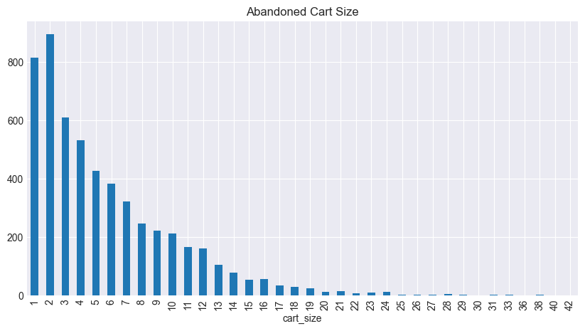
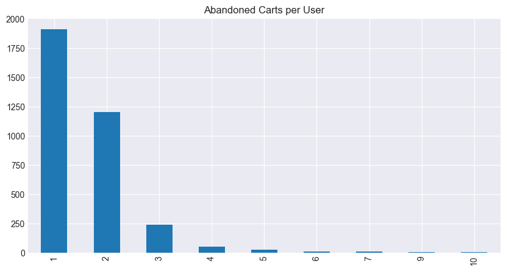
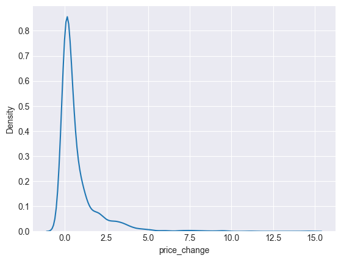
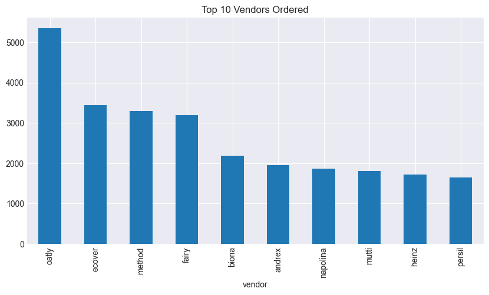
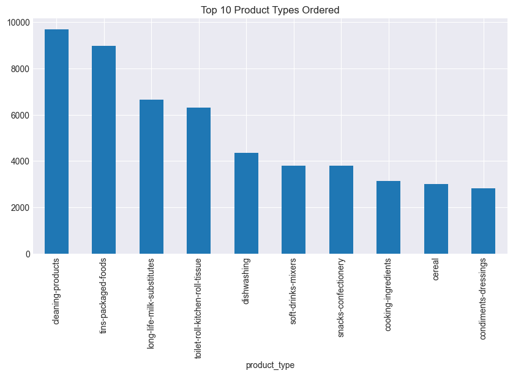
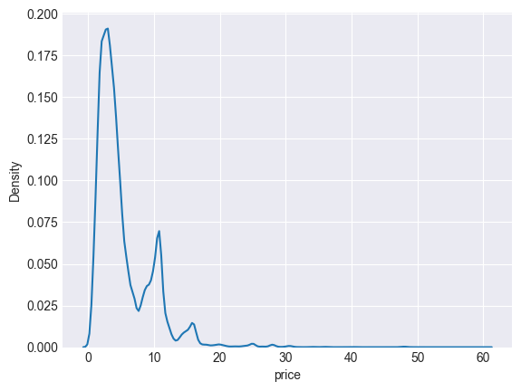
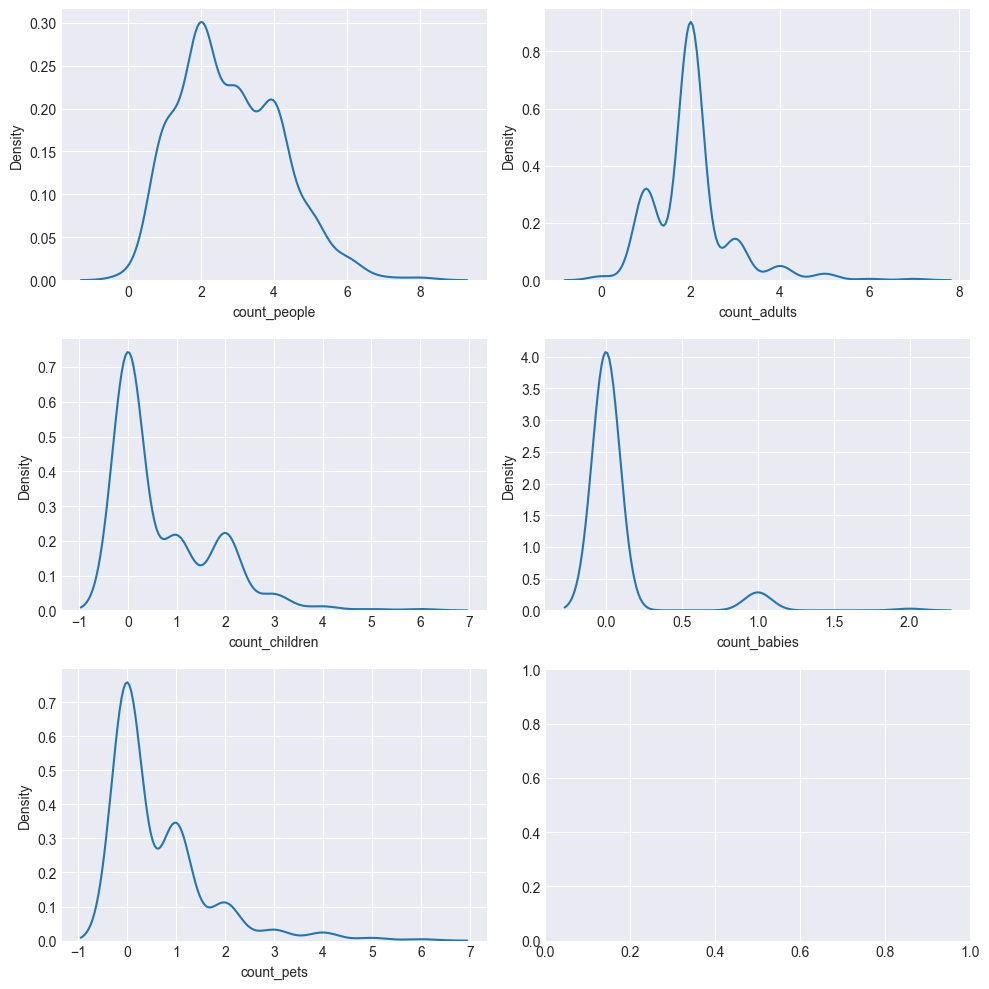
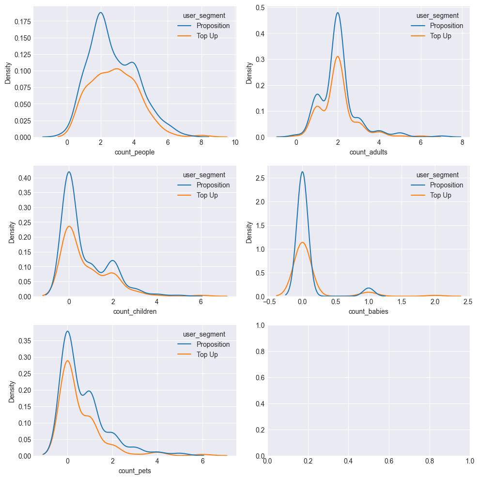

```python
import pandas as pd
import matplotlib.pyplot as plt
import seaborn as sns
```


```python
DATA_DIR = "../../data/module2/"
DATA_NAMES = ["users", "inventory", "orders", "abandoned_carts", "regulars"]
EXTENSION = ".parquet"
FILES = {name: DATA_DIR + name + EXTENSION for name in DATA_NAMES}
```


```python
# Load data
abandoned_cart = pd.read_parquet(FILES["abandoned_carts"])
inventory = pd.read_parquet(FILES["inventory"])
order = pd.read_parquet(FILES["orders"])
regulars = pd.read_parquet(FILES["regulars"])
users = pd.read_parquet(FILES["users"])
```


```python
abandoned_cart.head()
```


<div>
<style scoped>
    .dataframe tbody tr th:only-of-type {
        vertical-align: middle;
    }

    .dataframe tbody tr th {
        vertical-align: top;
    }

    .dataframe thead th {
        text-align: right;
    }
</style>
<table border="1" class="dataframe">
  <thead>
    <tr style="text-align: right;">
      <th></th>
      <th>id</th>
      <th>user_id</th>
      <th>created_at</th>
      <th>variant_id</th>
    </tr>
  </thead>
  <tbody>
    <tr>
      <th>0</th>
      <td>12858560217220</td>
      <td>5c4e5953f13ddc3bc9659a3453356155e5efe4739d7a2b...</td>
      <td>2020-05-20 13:53:24</td>
      <td>[33826459287684, 33826457616516, 3366719212762...</td>
    </tr>
    <tr>
      <th>13</th>
      <td>20352449839236</td>
      <td>9d6187545c005d39e44d0456d87790db18611d7c7379bd...</td>
      <td>2021-06-27 05:24:13</td>
      <td>[34415988179076, 34037940158596, 3450282236326...</td>
    </tr>
    <tr>
      <th>45</th>
      <td>20478401413252</td>
      <td>e83fb0273d70c37a2968fee107113698fd4f389c442c0b...</td>
      <td>2021-07-18 08:23:49</td>
      <td>[34543001337988, 34037939372164, 3411360609088...</td>
    </tr>
    <tr>
      <th>50</th>
      <td>20481783103620</td>
      <td>10c42e10e530284b7c7c50f3a23a98726d5747b8128084...</td>
      <td>2021-07-18 21:29:36</td>
      <td>[33667268116612, 34037940224132, 3443605520397...</td>
    </tr>
    <tr>
      <th>52</th>
      <td>20485321687172</td>
      <td>d9989439524b3f6fc4f41686d043f315fb408b954d6153...</td>
      <td>2021-07-19 12:17:05</td>
      <td>[33667268083844, 34284950454404, 33973246886020]</td>
    </tr>
  </tbody>
</table>
</div>


```python
abandoned_cart.info()
```

    <class 'pandas.core.frame.DataFrame'>
    Index: 5457 entries, 0 to 70050
    Data columns (total 4 columns):
     #   Column      Non-Null Count  Dtype         
    ---  ------      --------------  -----         
     0   id          5457 non-null   int64         
     1   user_id     5457 non-null   object        
     2   created_at  5457 non-null   datetime64[us]
     3   variant_id  5457 non-null   object        
    dtypes: datetime64[us](1), int64(1), object(2)
    memory usage: 213.2+ KB


```python
inventory.head()
```


<div>
<style scoped>
    .dataframe tbody tr th:only-of-type {
        vertical-align: middle;
    }

    .dataframe tbody tr th {
        vertical-align: top;
    }

    .dataframe thead th {
        text-align: right;
    }
</style>
<table border="1" class="dataframe">
  <thead>
    <tr style="text-align: right;">
      <th></th>
      <th>variant_id</th>
      <th>price</th>
      <th>compare_at_price</th>
      <th>vendor</th>
      <th>product_type</th>
      <th>tags</th>
    </tr>
  </thead>
  <tbody>
    <tr>
      <th>0</th>
      <td>39587297165444</td>
      <td>3.09</td>
      <td>3.15</td>
      <td>heinz</td>
      <td>condiments-dressings</td>
      <td>[table-sauces, vegan]</td>
    </tr>
    <tr>
      <th>1</th>
      <td>34370361229444</td>
      <td>4.99</td>
      <td>5.50</td>
      <td>whogivesacrap</td>
      <td>toilet-roll-kitchen-roll-tissue</td>
      <td>[b-corp, eco, toilet-rolls]</td>
    </tr>
    <tr>
      <th>2</th>
      <td>34284951863428</td>
      <td>3.69</td>
      <td>3.99</td>
      <td>plenty</td>
      <td>toilet-roll-kitchen-roll-tissue</td>
      <td>[kitchen-roll]</td>
    </tr>
    <tr>
      <th>3</th>
      <td>33667283583108</td>
      <td>1.79</td>
      <td>1.99</td>
      <td>thecheekypanda</td>
      <td>toilet-roll-kitchen-roll-tissue</td>
      <td>[b-corp, cruelty-free, eco, tissue, vegan]</td>
    </tr>
    <tr>
      <th>4</th>
      <td>33803537973380</td>
      <td>1.99</td>
      <td>2.09</td>
      <td>colgate</td>
      <td>dental</td>
      <td>[dental-accessories]</td>
    </tr>
  </tbody>
</table>
</div>


```python
inventory.info()
```

    <class 'pandas.core.frame.DataFrame'>
    RangeIndex: 1733 entries, 0 to 1732
    Data columns (total 6 columns):
     #   Column            Non-Null Count  Dtype  
    ---  ------            --------------  -----  
     0   variant_id        1733 non-null   int64  
     1   price             1733 non-null   float64
     2   compare_at_price  1733 non-null   float64
     3   vendor            1733 non-null   object 
     4   product_type      1733 non-null   object 
     5   tags              1733 non-null   object 
    dtypes: float64(2), int64(1), object(3)
    memory usage: 81.4+ KB


```python
order.head()
```


<div>
<style scoped>
    .dataframe tbody tr th:only-of-type {
        vertical-align: middle;
    }

    .dataframe tbody tr th {
        vertical-align: top;
    }

    .dataframe thead th {
        text-align: right;
    }
</style>
<table border="1" class="dataframe">
  <thead>
    <tr style="text-align: right;">
      <th></th>
      <th>id</th>
      <th>user_id</th>
      <th>created_at</th>
      <th>order_date</th>
      <th>user_order_seq</th>
      <th>ordered_items</th>
    </tr>
  </thead>
  <tbody>
    <tr>
      <th>10</th>
      <td>2204073066628</td>
      <td>62e271062eb827e411bd73941178d29b022f5f2de9d37f...</td>
      <td>2020-04-30 14:32:19</td>
      <td>2020-04-30</td>
      <td>1</td>
      <td>[33618849693828, 33618860179588, 3361887404045...</td>
    </tr>
    <tr>
      <th>20</th>
      <td>2204707520644</td>
      <td>bf591c887c46d5d3513142b6a855dd7ffb9cc00697f6f5...</td>
      <td>2020-04-30 17:39:00</td>
      <td>2020-04-30</td>
      <td>1</td>
      <td>[33618835243140, 33618835964036, 3361886244058...</td>
    </tr>
    <tr>
      <th>21</th>
      <td>2204838822020</td>
      <td>329f08c66abb51f8c0b8a9526670da2d94c0c6eef06700...</td>
      <td>2020-04-30 18:12:30</td>
      <td>2020-04-30</td>
      <td>1</td>
      <td>[33618891145348, 33618893570180, 3361889766618...</td>
    </tr>
    <tr>
      <th>34</th>
      <td>2208967852164</td>
      <td>f6451fce7b1c58d0effbe37fcb4e67b718193562766470...</td>
      <td>2020-05-01 19:44:11</td>
      <td>2020-05-01</td>
      <td>1</td>
      <td>[33618830196868, 33618846580868, 3361891234624...</td>
    </tr>
    <tr>
      <th>49</th>
      <td>2215889436804</td>
      <td>68e872ff888303bff58ec56a3a986f77ddebdbe5c279e7...</td>
      <td>2020-05-03 21:56:14</td>
      <td>2020-05-03</td>
      <td>1</td>
      <td>[33667166699652, 33667166699652, 3366717122163...</td>
    </tr>
  </tbody>
</table>
</div>


```python
order.info()
```

    <class 'pandas.core.frame.DataFrame'>
    Index: 8773 entries, 10 to 64538
    Data columns (total 6 columns):
     #   Column          Non-Null Count  Dtype         
    ---  ------          --------------  -----         
     0   id              8773 non-null   int64         
     1   user_id         8773 non-null   object        
     2   created_at      8773 non-null   datetime64[us]
     3   order_date      8773 non-null   datetime64[us]
     4   user_order_seq  8773 non-null   int64         
     5   ordered_items   8773 non-null   object        
    dtypes: datetime64[us](2), int64(2), object(2)
    memory usage: 479.8+ KB


```python
regulars.head()
```


<div>
<style scoped>
    .dataframe tbody tr th:only-of-type {
        vertical-align: middle;
    }

    .dataframe tbody tr th {
        vertical-align: top;
    }

    .dataframe thead th {
        text-align: right;
    }
</style>
<table border="1" class="dataframe">
  <thead>
    <tr style="text-align: right;">
      <th></th>
      <th>user_id</th>
      <th>variant_id</th>
      <th>created_at</th>
    </tr>
  </thead>
  <tbody>
    <tr>
      <th>3</th>
      <td>68e872ff888303bff58ec56a3a986f77ddebdbe5c279e7...</td>
      <td>33618848088196</td>
      <td>2020-04-30 15:07:03</td>
    </tr>
    <tr>
      <th>11</th>
      <td>aed88fc0b004270a62ff1fe4b94141f6b1db1496dbb0c0...</td>
      <td>33667178659972</td>
      <td>2020-05-05 23:34:35</td>
    </tr>
    <tr>
      <th>18</th>
      <td>68e872ff888303bff58ec56a3a986f77ddebdbe5c279e7...</td>
      <td>33619009208452</td>
      <td>2020-04-30 15:07:03</td>
    </tr>
    <tr>
      <th>46</th>
      <td>aed88fc0b004270a62ff1fe4b94141f6b1db1496dbb0c0...</td>
      <td>33667305373828</td>
      <td>2020-05-05 23:34:35</td>
    </tr>
    <tr>
      <th>47</th>
      <td>4594e99557113d5a1c5b59bf31b8704aafe5c7bd180b32...</td>
      <td>33667247341700</td>
      <td>2020-05-06 14:42:11</td>
    </tr>
  </tbody>
</table>
</div>


```python
regulars.info()
```

    <class 'pandas.core.frame.DataFrame'>
    Index: 18105 entries, 3 to 37720
    Data columns (total 3 columns):
     #   Column      Non-Null Count  Dtype         
    ---  ------      --------------  -----         
     0   user_id     18105 non-null  object        
     1   variant_id  18105 non-null  int64         
     2   created_at  18105 non-null  datetime64[us]
    dtypes: datetime64[us](1), int64(1), object(1)
    memory usage: 565.8+ KB


```python
users.head()
```


<div>
<style scoped>
    .dataframe tbody tr th:only-of-type {
        vertical-align: middle;
    }

    .dataframe tbody tr th {
        vertical-align: top;
    }

    .dataframe thead th {
        text-align: right;
    }
</style>
<table border="1" class="dataframe">
  <thead>
    <tr style="text-align: right;">
      <th></th>
      <th>user_id</th>
      <th>user_segment</th>
      <th>user_nuts1</th>
      <th>first_ordered_at</th>
      <th>customer_cohort_month</th>
      <th>count_people</th>
      <th>count_adults</th>
      <th>count_children</th>
      <th>count_babies</th>
      <th>count_pets</th>
    </tr>
  </thead>
  <tbody>
    <tr>
      <th>2160</th>
      <td>0e823a42e107461379e5b5613b7aa00537a72e1b0eaa7a...</td>
      <td>Top Up</td>
      <td>UKH</td>
      <td>2021-05-08 13:33:49</td>
      <td>2021-05-01 00:00:00</td>
      <td>NaN</td>
      <td>NaN</td>
      <td>NaN</td>
      <td>NaN</td>
      <td>NaN</td>
    </tr>
    <tr>
      <th>1123</th>
      <td>15768ced9bed648f745a7aa566a8895f7a73b9a47c1d4f...</td>
      <td>Top Up</td>
      <td>UKJ</td>
      <td>2021-11-17 16:30:20</td>
      <td>2021-11-01 00:00:00</td>
      <td>NaN</td>
      <td>NaN</td>
      <td>NaN</td>
      <td>NaN</td>
      <td>NaN</td>
    </tr>
    <tr>
      <th>1958</th>
      <td>33e0cb6eacea0775e34adbaa2c1dec16b9d6484e6b9324...</td>
      <td>Top Up</td>
      <td>UKD</td>
      <td>2022-03-09 23:12:25</td>
      <td>2022-03-01 00:00:00</td>
      <td>NaN</td>
      <td>NaN</td>
      <td>NaN</td>
      <td>NaN</td>
      <td>NaN</td>
    </tr>
    <tr>
      <th>675</th>
      <td>57ca7591dc79825df0cecc4836a58e6062454555c86c35...</td>
      <td>Top Up</td>
      <td>UKI</td>
      <td>2021-04-23 16:29:02</td>
      <td>2021-04-01 00:00:00</td>
      <td>NaN</td>
      <td>NaN</td>
      <td>NaN</td>
      <td>NaN</td>
      <td>NaN</td>
    </tr>
    <tr>
      <th>4694</th>
      <td>085d8e598139ce6fc9f75d9de97960fa9e1457b409ec00...</td>
      <td>Top Up</td>
      <td>UKJ</td>
      <td>2021-11-02 13:50:06</td>
      <td>2021-11-01 00:00:00</td>
      <td>NaN</td>
      <td>NaN</td>
      <td>NaN</td>
      <td>NaN</td>
      <td>NaN</td>
    </tr>
  </tbody>
</table>
</div>


```python
users.info()
```

    <class 'pandas.core.frame.DataFrame'>
    Index: 4983 entries, 2160 to 3360
    Data columns (total 10 columns):
     #   Column                 Non-Null Count  Dtype  
    ---  ------                 --------------  -----  
     0   user_id                4983 non-null   object 
     1   user_segment           4983 non-null   object 
     2   user_nuts1             4932 non-null   object 
     3   first_ordered_at       4983 non-null   object 
     4   customer_cohort_month  4983 non-null   object 
     5   count_people           325 non-null    float64
     6   count_adults           325 non-null    float64
     7   count_children         325 non-null    float64
     8   count_babies           325 non-null    float64
     9   count_pets             325 non-null    float64
    dtypes: float64(5), object(5)
    memory usage: 428.2+ KB


---

# EDA

## Abandoned Carts Analysis

We are going to check the size of abandoned carts


```python
# Calculate abandoned carts size and its frecuency
abandoned_cart["cart_size"] = abandoned_cart["variant_id"].apply(lambda x: len(x))
abandoned_cart_size_frecuency = abandoned_cart["cart_size"].value_counts()

plt.style.use(style="seaborn-v0_8-darkgrid")
abandoned_cart_size_frecuency.sort_index().plot(
    kind="bar", figsize=(10, 5), title="Abandoned Cart Size"
)
pass
```


    

    


We observe that, the majority of abandoned carts have 10 items or less, being 2 items the most common case.

Now, let's check if there are some users that have many abandoned carts


```python
# Abandoned carts per user
abandoned_carts_users = abandoned_cart.groupby("user_id").size()
abandoned_cart_users_frecuency = abandoned_carts_users.value_counts()
abandoned_cart_users_frecuency.sort_index().plot(
    kind="bar", figsize=(10, 5), title="Abandoned Carts per User"
)
pass
```


    

    


Most of the users that have abandoned carts have only one abandoned cart. However, there are a few who surpass 3 abandoned carts.
We have to consider that some platforms allow users to have multiple abandoned carts.

## Inventory Analysis

First of all, let's see the range of prices of the products in the inventory


```python
sns.kdeplot(inventory["price"])
plt.title("Price Distribution in Inventory")
pass
```


    

    


The majority of products are in a range of prices below or equal to 5 dollars.

Let's compare it with the `compare_at_price` variable, i.e. the original price, as some products might have gotten a discount or an increase of prices


```python
inventory["price_change"] = inventory["compare_at_price"] - inventory["price"]
sns.kdeplot(inventory["price_change"])
pass
```


    

    


```python
inventory[inventory["price_change"] < 0]
```


<div>
<style scoped>
    .dataframe tbody tr th:only-of-type {
        vertical-align: middle;
    }

    .dataframe tbody tr th {
        vertical-align: top;
    }

    .dataframe thead th {
        text-align: right;
    }
</style>
<table border="1" class="dataframe">
  <thead>
    <tr style="text-align: right;">
      <th></th>
      <th>variant_id</th>
      <th>price</th>
      <th>compare_at_price</th>
      <th>vendor</th>
      <th>product_type</th>
      <th>tags</th>
      <th>price_change</th>
    </tr>
  </thead>
  <tbody>
    <tr>
      <th>548</th>
      <td>34488548294788</td>
      <td>4.50</td>
      <td>4.25</td>
      <td>pedigree</td>
      <td>dog-food</td>
      <td>[wet-dog-food]</td>
      <td>-0.25</td>
    </tr>
    <tr>
      <th>586</th>
      <td>40099114188932</td>
      <td>0.01</td>
      <td>0.00</td>
      <td>bother</td>
      <td></td>
      <td>[discontinue, trade-swap]</td>
      <td>-0.01</td>
    </tr>
    <tr>
      <th>863</th>
      <td>34488547704964</td>
      <td>4.50</td>
      <td>4.25</td>
      <td>pedigree</td>
      <td>dog-food</td>
      <td>[wet-dog-food]</td>
      <td>-0.25</td>
    </tr>
  </tbody>
</table>
</div>


As we might observe, some products (3) have experimented an increase, whilst the rest all remain equal or at a lower price.

# Orders Analysis

Let's check which products have been ordered the most, and so as with the vendors.


```python
products_ordered = order.explode("ordered_items").reset_index(drop=True)
products_ordered = products_ordered.merge(
    inventory, left_on="ordered_items", right_on="variant_id"
).rename(columns={"id": "order_id"})
products_ordered.info()
```

    <class 'pandas.core.frame.DataFrame'>
    RangeIndex: 92361 entries, 0 to 92360
    Data columns (total 13 columns):
     #   Column            Non-Null Count  Dtype         
    ---  ------            --------------  -----         
     0   order_id          92361 non-null  int64         
     1   user_id           92361 non-null  object        
     2   created_at        92361 non-null  datetime64[us]
     3   order_date        92361 non-null  datetime64[us]
     4   user_order_seq    92361 non-null  int64         
     5   ordered_items     92361 non-null  object        
     6   variant_id        92361 non-null  int64         
     7   price             92361 non-null  float64       
     8   compare_at_price  92361 non-null  float64       
     9   vendor            92361 non-null  object        
     10  product_type      92361 non-null  object        
     11  tags              92361 non-null  object        
     12  price_change      92361 non-null  float64       
    dtypes: datetime64[us](2), float64(3), int64(3), object(5)
    memory usage: 9.2+ MB


```python
products_ordered.head()
```


<div>
<style scoped>
    .dataframe tbody tr th:only-of-type {
        vertical-align: middle;
    }

    .dataframe tbody tr th {
        vertical-align: top;
    }

    .dataframe thead th {
        text-align: right;
    }
</style>
<table border="1" class="dataframe">
  <thead>
    <tr style="text-align: right;">
      <th></th>
      <th>order_id</th>
      <th>user_id</th>
      <th>created_at</th>
      <th>order_date</th>
      <th>user_order_seq</th>
      <th>ordered_items</th>
      <th>variant_id</th>
      <th>price</th>
      <th>compare_at_price</th>
      <th>vendor</th>
      <th>product_type</th>
      <th>tags</th>
      <th>price_change</th>
    </tr>
  </thead>
  <tbody>
    <tr>
      <th>0</th>
      <td>2215889436804</td>
      <td>68e872ff888303bff58ec56a3a986f77ddebdbe5c279e7...</td>
      <td>2020-05-03 21:56:14</td>
      <td>2020-05-03</td>
      <td>1</td>
      <td>33667238658180</td>
      <td>33667238658180</td>
      <td>4.19</td>
      <td>5.10</td>
      <td>listerine</td>
      <td>dental</td>
      <td>[mouthwash]</td>
      <td>0.91</td>
    </tr>
    <tr>
      <th>1</th>
      <td>2215889436804</td>
      <td>68e872ff888303bff58ec56a3a986f77ddebdbe5c279e7...</td>
      <td>2020-05-03 21:56:14</td>
      <td>2020-05-03</td>
      <td>1</td>
      <td>33667238658180</td>
      <td>33667238658180</td>
      <td>4.19</td>
      <td>5.10</td>
      <td>listerine</td>
      <td>dental</td>
      <td>[mouthwash]</td>
      <td>0.91</td>
    </tr>
    <tr>
      <th>2</th>
      <td>2217346236548</td>
      <td>66a7b6a77952abc3ef3246da56fb148814704a3c2b420c...</td>
      <td>2020-05-04 11:25:26</td>
      <td>2020-05-04</td>
      <td>1</td>
      <td>33667206054020</td>
      <td>33667206054020</td>
      <td>17.99</td>
      <td>20.65</td>
      <td>ecover</td>
      <td>delicates-stain-remover</td>
      <td>[cruelty-free, delicates-stain-remover, eco, v...</td>
      <td>2.66</td>
    </tr>
    <tr>
      <th>3</th>
      <td>2217346236548</td>
      <td>66a7b6a77952abc3ef3246da56fb148814704a3c2b420c...</td>
      <td>2020-05-04 11:25:26</td>
      <td>2020-05-04</td>
      <td>1</td>
      <td>33667206283396</td>
      <td>33667206283396</td>
      <td>9.99</td>
      <td>12.00</td>
      <td>ecover</td>
      <td>fabric-softener-freshener</td>
      <td>[cruelty-free, eco, fabric-softener-freshener,...</td>
      <td>2.01</td>
    </tr>
    <tr>
      <th>4</th>
      <td>2217346236548</td>
      <td>66a7b6a77952abc3ef3246da56fb148814704a3c2b420c...</td>
      <td>2020-05-04 11:25:26</td>
      <td>2020-05-04</td>
      <td>1</td>
      <td>39459277602948</td>
      <td>39459277602948</td>
      <td>5.79</td>
      <td>5.98</td>
      <td>ecloth</td>
      <td>cleaning-products</td>
      <td>[eco, sponges-cloths-gloves]</td>
      <td>0.19</td>
    </tr>
  </tbody>
</table>
</div>


```python
products_ordered["product_type"].value_counts()
```


    product_type
    cleaning-products                  9676
    tins-packaged-foods                8959
    long-life-milk-substitutes         6637
    toilet-roll-kitchen-roll-tissue    6314
    dishwashing                        4362
    soft-drinks-mixers                 3808
    snacks-confectionery               3787
    cooking-ingredients                3150
    cereal                             3014
    condiments-dressings               2821
    cooking-sauces                     2631
    fabric-softener-freshener          2443
    pasta-rice-noodles                 2443
    dental                             2161
    biscuits-crackers                  2008
    hand-soap-sanitisers               1981
    spreads                            1926
    home-baking                        1808
    haircare                           1552
    washing-liquid-gel                 1482
    washing-powder                     1475
    tea                                1232
    bath-shower-gel                    1142
    skincare                           1128
    washing-capsules                   1127
    bin-bags                           1083
    period-care                        1026
    wine                               1009
    cat-food                            963
    beer                                953
    food-bags-cling-film-foil           848
    baby-kids-toiletries                825
    baby-milk-formula                   787
    coffee                              729
    dog-food                            677
    delicates-stain-remover             648
    spirits-liqueurs                    578
    baby-toddler-food                   484
    nappies-nappy-pants                 348
    baby-accessories                    307
    deodorant                           299
    drying-ironing                      245
    pet-care                            238
    cider                               215
    shaving-grooming                    205
    superfoods-supplements              159
    household-sundries                  146
    medicines-treatments                 97
    water-softener                       82
    other-hot-drinks                     68
    low-no-alcohol                       58
    sexual-health                        42
    maternity                            40
    adult-incontinence                   39
    suncare                              38
    premixed-cocktails                   29
    medicine-treatments                  27
    mixed-bundles                         2
    Name: count, dtype: int64


```python
products_ordered["product_type"].value_counts()[:10].plot(
    kind="bar", figsize=(10, 5), title="Top 10 Product Types Ordered"
)
pass
```


    

    


```python
products_ordered["vendor"].value_counts()
```


    vendor
    oatly             5345
    ecover            3445
    method            3293
    fairy             3188
    biona             2184
                      ... 
    gordans              1
    seedlip              1
    sudafed              1
    enterosgel           1
    stlawrencegold       1
    Name: count, Length: 402, dtype: int64


```python
products_ordered["vendor"].value_counts()[:10].plot(
    kind="bar", figsize=(10, 5), title="Top 10 Vendors Ordered"
)
pass
```


    

    


```python
products_ordered["product_type"].value_counts()[:10].plot(
    kind="bar", figsize=(10, 5), title="Top 10 Product Types Ordered"
)
pass
```


    

    


Let's repeat the price range plot, but with ordered products


```python
sns.kdeplot(products_ordered["price"])
```


    <Axes: xlabel='price', ylabel='Density'>


    

    


## Users Analysis


```python
users.info()
```

    <class 'pandas.core.frame.DataFrame'>
    Index: 4983 entries, 2160 to 3360
    Data columns (total 10 columns):
     #   Column                 Non-Null Count  Dtype  
    ---  ------                 --------------  -----  
     0   user_id                4983 non-null   object 
     1   user_segment           4983 non-null   object 
     2   user_nuts1             4932 non-null   object 
     3   first_ordered_at       4983 non-null   object 
     4   customer_cohort_month  4983 non-null   object 
     5   count_people           325 non-null    float64
     6   count_adults           325 non-null    float64
     7   count_children         325 non-null    float64
     8   count_babies           325 non-null    float64
     9   count_pets             325 non-null    float64
    dtypes: float64(5), object(5)
    memory usage: 428.2+ KB


As we can see, there are too many missing values in the "count" columns.


```python
users.head()
```


<div>
<style scoped>
    .dataframe tbody tr th:only-of-type {
        vertical-align: middle;
    }

    .dataframe tbody tr th {
        vertical-align: top;
    }

    .dataframe thead th {
        text-align: right;
    }
</style>
<table border="1" class="dataframe">
  <thead>
    <tr style="text-align: right;">
      <th></th>
      <th>user_id</th>
      <th>user_segment</th>
      <th>user_nuts1</th>
      <th>first_ordered_at</th>
      <th>customer_cohort_month</th>
      <th>count_people</th>
      <th>count_adults</th>
      <th>count_children</th>
      <th>count_babies</th>
      <th>count_pets</th>
    </tr>
  </thead>
  <tbody>
    <tr>
      <th>2160</th>
      <td>0e823a42e107461379e5b5613b7aa00537a72e1b0eaa7a...</td>
      <td>Top Up</td>
      <td>UKH</td>
      <td>2021-05-08 13:33:49</td>
      <td>2021-05-01 00:00:00</td>
      <td>NaN</td>
      <td>NaN</td>
      <td>NaN</td>
      <td>NaN</td>
      <td>NaN</td>
    </tr>
    <tr>
      <th>1123</th>
      <td>15768ced9bed648f745a7aa566a8895f7a73b9a47c1d4f...</td>
      <td>Top Up</td>
      <td>UKJ</td>
      <td>2021-11-17 16:30:20</td>
      <td>2021-11-01 00:00:00</td>
      <td>NaN</td>
      <td>NaN</td>
      <td>NaN</td>
      <td>NaN</td>
      <td>NaN</td>
    </tr>
    <tr>
      <th>1958</th>
      <td>33e0cb6eacea0775e34adbaa2c1dec16b9d6484e6b9324...</td>
      <td>Top Up</td>
      <td>UKD</td>
      <td>2022-03-09 23:12:25</td>
      <td>2022-03-01 00:00:00</td>
      <td>NaN</td>
      <td>NaN</td>
      <td>NaN</td>
      <td>NaN</td>
      <td>NaN</td>
    </tr>
    <tr>
      <th>675</th>
      <td>57ca7591dc79825df0cecc4836a58e6062454555c86c35...</td>
      <td>Top Up</td>
      <td>UKI</td>
      <td>2021-04-23 16:29:02</td>
      <td>2021-04-01 00:00:00</td>
      <td>NaN</td>
      <td>NaN</td>
      <td>NaN</td>
      <td>NaN</td>
      <td>NaN</td>
    </tr>
    <tr>
      <th>4694</th>
      <td>085d8e598139ce6fc9f75d9de97960fa9e1457b409ec00...</td>
      <td>Top Up</td>
      <td>UKJ</td>
      <td>2021-11-02 13:50:06</td>
      <td>2021-11-01 00:00:00</td>
      <td>NaN</td>
      <td>NaN</td>
      <td>NaN</td>
      <td>NaN</td>
      <td>NaN</td>
    </tr>
  </tbody>
</table>
</div>


```python
users["null_flag"] = users.isnull().any(axis=1)
users[users["null_flag"] == False].head()
```


<div>
<style scoped>
    .dataframe tbody tr th:only-of-type {
        vertical-align: middle;
    }

    .dataframe tbody tr th {
        vertical-align: top;
    }

    .dataframe thead th {
        text-align: right;
    }
</style>
<table border="1" class="dataframe">
  <thead>
    <tr style="text-align: right;">
      <th></th>
      <th>user_id</th>
      <th>user_segment</th>
      <th>user_nuts1</th>
      <th>first_ordered_at</th>
      <th>customer_cohort_month</th>
      <th>count_people</th>
      <th>count_adults</th>
      <th>count_children</th>
      <th>count_babies</th>
      <th>count_pets</th>
      <th>null_flag</th>
    </tr>
  </thead>
  <tbody>
    <tr>
      <th>4751</th>
      <td>09d70e0b0778117aec5550c08032d56f8e06f992741680...</td>
      <td>Proposition</td>
      <td>UKI</td>
      <td>2021-06-28 12:07:04</td>
      <td>2021-06-01 00:00:00</td>
      <td>1.0</td>
      <td>1.0</td>
      <td>0.0</td>
      <td>0.0</td>
      <td>0.0</td>
      <td>False</td>
    </tr>
    <tr>
      <th>3154</th>
      <td>4f5ff38ce5ed48096ba80dff80e167db1ad24b9ebdb00c...</td>
      <td>Top Up</td>
      <td>UKD</td>
      <td>2020-06-12 12:07:35</td>
      <td>2020-06-01 00:00:00</td>
      <td>3.0</td>
      <td>2.0</td>
      <td>0.0</td>
      <td>1.0</td>
      <td>0.0</td>
      <td>False</td>
    </tr>
    <tr>
      <th>736</th>
      <td>7b2ae50bb11646436fa613394fc3e71e1a0cdc3ba30cdb...</td>
      <td>Proposition</td>
      <td>UKF</td>
      <td>2020-10-03 09:53:57</td>
      <td>2020-10-01 00:00:00</td>
      <td>2.0</td>
      <td>2.0</td>
      <td>0.0</td>
      <td>0.0</td>
      <td>2.0</td>
      <td>False</td>
    </tr>
    <tr>
      <th>4792</th>
      <td>5e977a4aa2c57f306b8a22f92eaaa177f7dc31a52df82c...</td>
      <td>Proposition</td>
      <td>UKI</td>
      <td>2021-10-14 10:41:13</td>
      <td>2021-10-01 00:00:00</td>
      <td>2.0</td>
      <td>1.0</td>
      <td>1.0</td>
      <td>0.0</td>
      <td>1.0</td>
      <td>False</td>
    </tr>
    <tr>
      <th>2217</th>
      <td>eafb89ad33eb377adb98a915b6a5a65f1284c2db517d07...</td>
      <td>Proposition</td>
      <td>UKH</td>
      <td>2022-01-20 15:53:09</td>
      <td>2022-01-01 00:00:00</td>
      <td>2.0</td>
      <td>2.0</td>
      <td>0.0</td>
      <td>0.0</td>
      <td>0.0</td>
      <td>False</td>
    </tr>
  </tbody>
</table>
</div>


As the ones with no missing values might be of more value, we'll analyze them, instead of the whole dataframe


```python
count_cols = [col for col in users.columns if "count" in col]
users_complete = users.dropna(subset=count_cols)
```


```python
users["user_segment"].value_counts()
```


    user_segment
    Top Up         2643
    Proposition    2340
    Name: count, dtype: int64


```python
users["user_nuts1"].value_counts()
```


    user_nuts1
    UKI    1318
    UKJ     745
    UKK     602
    UKH     414
    UKD     358
    UKM     315
    UKE     303
    UKG     295
    UKF     252
    UKL     224
    UKC     102
    UKN       4
    Name: count, dtype: int64


```python
pd.crosstab(users["user_nuts1"], users["user_segment"]).plot(
    kind="bar", figsize=(10, 5), title="User Segments per Region"
)
```


    <Axes: title={'center': 'User Segments per Region'}, xlabel='user_nuts1'>


    

    


```python
fig, ax = plt.subplots(3, 2, figsize=(10, 10))
ax = ax.flatten()
for index, col in enumerate(count_cols):
    sns.kdeplot(users_complete, x=col, ax=ax[index])

plt.tight_layout()
```


    

    


```python
fig, ax = plt.subplots(3, 2, figsize=(10, 10))
ax = ax.flatten()
for index, col in enumerate(count_cols):
    sns.kdeplot(users_complete, x=col, hue="user_segment", ax=ax[index])

plt.tight_layout()
```


    

    

