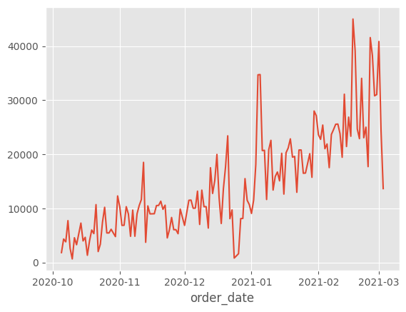
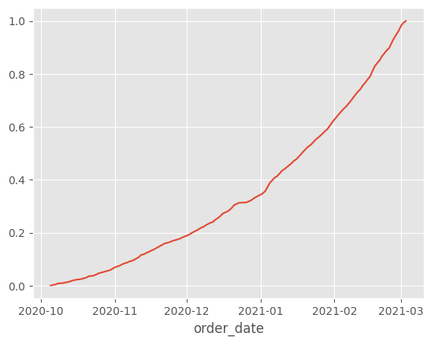
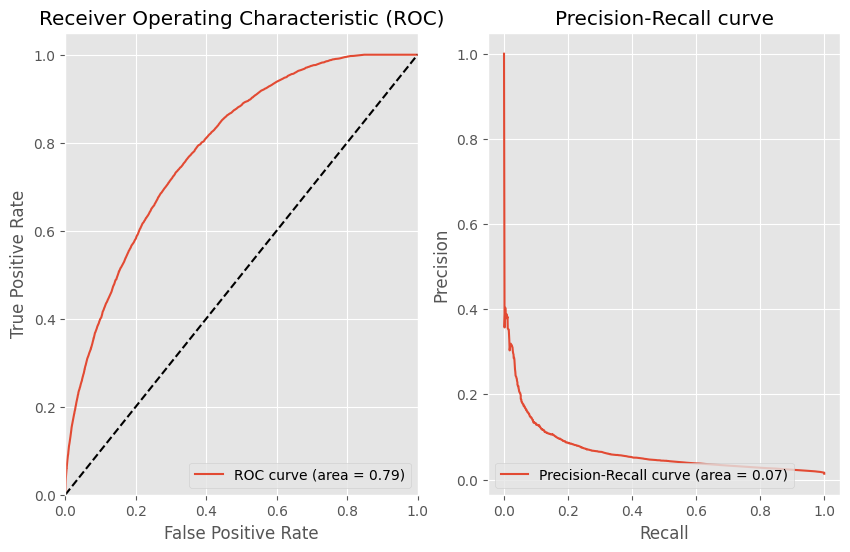
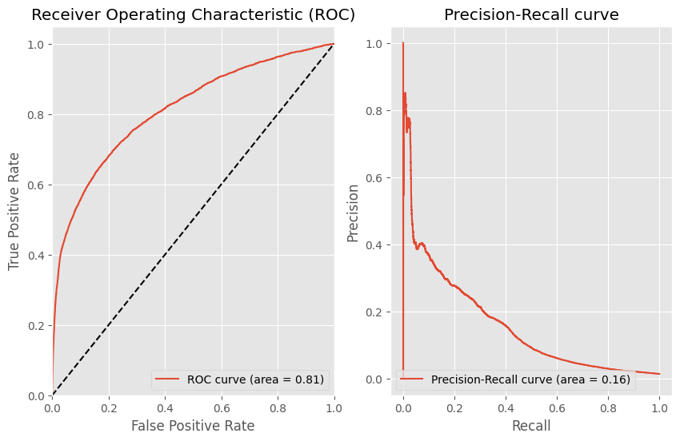
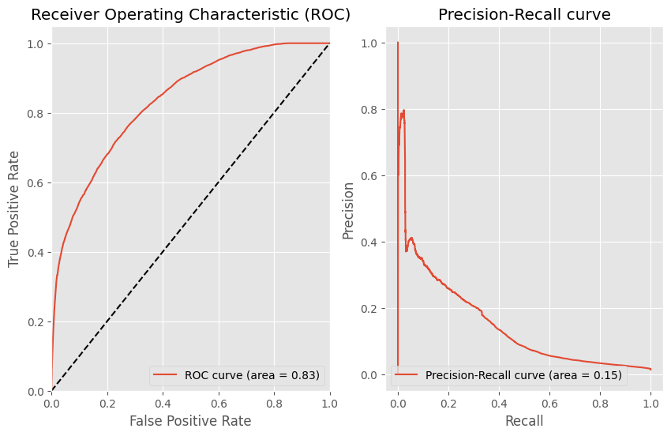

# Data Loading
Before beginning with the task, let's import the dataset that is going to be used along this module. This dataset was explored in the module before.


```python
import pandas as pd
import numpy as np
import matplotlib.pyplot as plt
from sklearn.linear_model import LogisticRegression
from sklearn.preprocessing import StandardScaler
from sklearn.pipeline import make_pipeline

from functions import (
    three_way_split_time,
    logit_significance,
    get_best_treshold,
    print_metrics,
    plot_auc_pr_curve,
    pick_features_for_splits
)
```


```python
plt.style.use('ggplot')
```


```python
df = pd.read_csv('../../data/module2/feature_frame.csv')
df.head()
```


<div>
<style scoped>
    .dataframe tbody tr th:only-of-type {
        vertical-align: middle;
    }

    .dataframe tbody tr th {
        vertical-align: top;
    }

    .dataframe thead th {
        text-align: right;
    }
</style>
<table border="1" class="dataframe">
  <thead>
    <tr style="text-align: right;">
      <th></th>
      <th>variant_id</th>
      <th>product_type</th>
      <th>order_id</th>
      <th>user_id</th>
      <th>created_at</th>
      <th>order_date</th>
      <th>user_order_seq</th>
      <th>outcome</th>
      <th>ordered_before</th>
      <th>abandoned_before</th>
      <th>...</th>
      <th>count_children</th>
      <th>count_babies</th>
      <th>count_pets</th>
      <th>people_ex_baby</th>
      <th>days_since_purchase_variant_id</th>
      <th>avg_days_to_buy_variant_id</th>
      <th>std_days_to_buy_variant_id</th>
      <th>days_since_purchase_product_type</th>
      <th>avg_days_to_buy_product_type</th>
      <th>std_days_to_buy_product_type</th>
    </tr>
  </thead>
  <tbody>
    <tr>
      <th>0</th>
      <td>33826472919172</td>
      <td>ricepastapulses</td>
      <td>2807985930372</td>
      <td>3482464092292</td>
      <td>2020-10-05 16:46:19</td>
      <td>2020-10-05 00:00:00</td>
      <td>3</td>
      <td>0.0</td>
      <td>0.0</td>
      <td>0.0</td>
      <td>...</td>
      <td>0.0</td>
      <td>0.0</td>
      <td>0.0</td>
      <td>2.0</td>
      <td>33.0</td>
      <td>42.0</td>
      <td>31.134053</td>
      <td>30.0</td>
      <td>30.0</td>
      <td>24.27618</td>
    </tr>
    <tr>
      <th>1</th>
      <td>33826472919172</td>
      <td>ricepastapulses</td>
      <td>2808027644036</td>
      <td>3466586718340</td>
      <td>2020-10-05 17:59:51</td>
      <td>2020-10-05 00:00:00</td>
      <td>2</td>
      <td>0.0</td>
      <td>0.0</td>
      <td>0.0</td>
      <td>...</td>
      <td>0.0</td>
      <td>0.0</td>
      <td>0.0</td>
      <td>2.0</td>
      <td>33.0</td>
      <td>42.0</td>
      <td>31.134053</td>
      <td>30.0</td>
      <td>30.0</td>
      <td>24.27618</td>
    </tr>
    <tr>
      <th>2</th>
      <td>33826472919172</td>
      <td>ricepastapulses</td>
      <td>2808099078276</td>
      <td>3481384026244</td>
      <td>2020-10-05 20:08:53</td>
      <td>2020-10-05 00:00:00</td>
      <td>4</td>
      <td>0.0</td>
      <td>0.0</td>
      <td>0.0</td>
      <td>...</td>
      <td>0.0</td>
      <td>0.0</td>
      <td>0.0</td>
      <td>2.0</td>
      <td>33.0</td>
      <td>42.0</td>
      <td>31.134053</td>
      <td>30.0</td>
      <td>30.0</td>
      <td>24.27618</td>
    </tr>
    <tr>
      <th>3</th>
      <td>33826472919172</td>
      <td>ricepastapulses</td>
      <td>2808393957508</td>
      <td>3291363377284</td>
      <td>2020-10-06 08:57:59</td>
      <td>2020-10-06 00:00:00</td>
      <td>2</td>
      <td>0.0</td>
      <td>0.0</td>
      <td>0.0</td>
      <td>...</td>
      <td>0.0</td>
      <td>0.0</td>
      <td>0.0</td>
      <td>2.0</td>
      <td>33.0</td>
      <td>42.0</td>
      <td>31.134053</td>
      <td>30.0</td>
      <td>30.0</td>
      <td>24.27618</td>
    </tr>
    <tr>
      <th>4</th>
      <td>33826472919172</td>
      <td>ricepastapulses</td>
      <td>2808429314180</td>
      <td>3537167515780</td>
      <td>2020-10-06 10:37:05</td>
      <td>2020-10-06 00:00:00</td>
      <td>3</td>
      <td>0.0</td>
      <td>0.0</td>
      <td>0.0</td>
      <td>...</td>
      <td>0.0</td>
      <td>0.0</td>
      <td>0.0</td>
      <td>2.0</td>
      <td>33.0</td>
      <td>42.0</td>
      <td>31.134053</td>
      <td>30.0</td>
      <td>30.0</td>
      <td>24.27618</td>
    </tr>
  </tbody>
</table>
<p>5 rows × 27 columns</p>
</div>


> We are only interested in users that purchases the item along with at least other 4 (minimum 5 items basket), since shipping costs for a single or few items can be higher than the gross margin coming from it.


```python
ordered = df[df['outcome'] == 1] # have been ordered
orders_len = ordered.groupby('order_id').outcome.sum() 
orders_selection = orders_len[orders_len >= 5].index
df2 = df[df['order_id'].isin(orders_selection)]
```


```python
df['order_id'].nunique() > df2['order_id'].nunique()
```


    True


```python
df2.columns
```


    Index(['variant_id', 'product_type', 'order_id', 'user_id', 'created_at',
           'order_date', 'user_order_seq', 'outcome', 'ordered_before',
           'abandoned_before', 'active_snoozed', 'set_as_regular',
           'normalised_price', 'discount_pct', 'vendor', 'global_popularity',
           'count_adults', 'count_children', 'count_babies', 'count_pets',
           'people_ex_baby', 'days_since_purchase_variant_id',
           'avg_days_to_buy_variant_id', 'std_days_to_buy_variant_id',
           'days_since_purchase_product_type', 'avg_days_to_buy_product_type',
           'std_days_to_buy_product_type'],
          dtype='object')


```python
info_cols = ['variant_id', 'order_id', 'user_id', 'order_date', 'created_at']
label_cols = ['outcome']
features_cols = [col for col in df2.columns if col not in info_cols + label_cols]
categorical_cols = ['product_type', 'vendor']
binary_cols = ['ordered_before', 'abandoned_before', 'active_snoozed', 'set_as_regular']
numerical_cols = [col for col in features_cols if col not in categorical_cols + binary_cols]
```


```python
df2['order_date'] = pd.to_datetime(df2['order_date']).dt.date
df2['created_at'] = pd.to_datetime(df2['created_at'])
```

    /var/folders/9s/g205zh4n1qxctfk8d568b41c0000gn/T/ipykernel_3756/644260562.py:1: SettingWithCopyWarning: 
    A value is trying to be set on a copy of a slice from a DataFrame.
    Try using .loc[row_indexer,col_indexer] = value instead
    
    See the caveats in the documentation: https://pandas.pydata.org/pandas-docs/stable/user_guide/indexing.html#returning-a-view-versus-a-copy
      df2['order_date'] = pd.to_datetime(df2['order_date']).dt.date
    /var/folders/9s/g205zh4n1qxctfk8d568b41c0000gn/T/ipykernel_3756/644260562.py:2: SettingWithCopyWarning: 
    A value is trying to be set on a copy of a slice from a DataFrame.
    Try using .loc[row_indexer,col_indexer] = value instead
    
    See the caveats in the documentation: https://pandas.pydata.org/pandas-docs/stable/user_guide/indexing.html#returning-a-view-versus-a-copy
      df2['created_at'] = pd.to_datetime(df2['created_at'])


```python
X = df2[features_cols+info_cols]
Y = df2[label_cols]
```


```python
X = X.sort_values('order_date')
    
# Reorganizar Y basado en el índice de X
Y = Y.loc[X.index]

# Agrupar por fecha y obtener el acumulado de órdenes
daily_orders = X.groupby('order_date').size()
cumsum_daily_orders = daily_orders.cumsum() / daily_orders.sum()
daily_orders.plot()
```


    <Axes: xlabel='order_date'>


    

    


```python
cumsum_daily_orders.plot()
```


    <Axes: xlabel='order_date'>


    

    


```python
X_train, X_val, X_test, Y_train, Y_val, Y_test = three_way_split_time(X, Y)
X_train.tail()
```


<div>
<style scoped>
    .dataframe tbody tr th:only-of-type {
        vertical-align: middle;
    }

    .dataframe tbody tr th {
        vertical-align: top;
    }

    .dataframe thead th {
        text-align: right;
    }
</style>
<table border="1" class="dataframe">
  <thead>
    <tr style="text-align: right;">
      <th></th>
      <th>product_type</th>
      <th>user_order_seq</th>
      <th>ordered_before</th>
      <th>abandoned_before</th>
      <th>active_snoozed</th>
      <th>set_as_regular</th>
      <th>normalised_price</th>
      <th>discount_pct</th>
      <th>vendor</th>
      <th>global_popularity</th>
      <th>...</th>
      <th>avg_days_to_buy_variant_id</th>
      <th>std_days_to_buy_variant_id</th>
      <th>days_since_purchase_product_type</th>
      <th>avg_days_to_buy_product_type</th>
      <th>std_days_to_buy_product_type</th>
      <th>variant_id</th>
      <th>order_id</th>
      <th>user_id</th>
      <th>order_date</th>
      <th>created_at</th>
    </tr>
  </thead>
  <tbody>
    <tr>
      <th>1526851</th>
      <td>pickledfoodolives</td>
      <td>2</td>
      <td>0.0</td>
      <td>0.0</td>
      <td>0.0</td>
      <td>0.0</td>
      <td>0.056655</td>
      <td>0.076555</td>
      <td>kühne</td>
      <td>0.003888</td>
      <td>...</td>
      <td>32.0</td>
      <td>23.781019</td>
      <td>30.0</td>
      <td>30.0</td>
      <td>25.477284</td>
      <td>34368926449796</td>
      <td>2916537696388</td>
      <td>3882518708356</td>
      <td>2021-02-07</td>
      <td>2021-02-07 17:08:35</td>
    </tr>
    <tr>
      <th>2835008</th>
      <td>floorcleanerpolish</td>
      <td>4</td>
      <td>0.0</td>
      <td>0.0</td>
      <td>0.0</td>
      <td>0.0</td>
      <td>0.032258</td>
      <td>0.084034</td>
      <td>mrsheen</td>
      <td>0.000000</td>
      <td>...</td>
      <td>71.5</td>
      <td>36.224678</td>
      <td>13.0</td>
      <td>38.5</td>
      <td>31.832738</td>
      <td>34284951339140</td>
      <td>2916421664900</td>
      <td>3900863086724</td>
      <td>2021-02-07</td>
      <td>2021-02-07 14:29:53</td>
    </tr>
    <tr>
      <th>1526852</th>
      <td>pickledfoodolives</td>
      <td>2</td>
      <td>0.0</td>
      <td>0.0</td>
      <td>0.0</td>
      <td>0.0</td>
      <td>0.056655</td>
      <td>0.076555</td>
      <td>kühne</td>
      <td>0.003888</td>
      <td>...</td>
      <td>32.0</td>
      <td>23.781019</td>
      <td>30.0</td>
      <td>30.0</td>
      <td>25.477284</td>
      <td>34368926449796</td>
      <td>2916544610436</td>
      <td>3879696957572</td>
      <td>2021-02-07</td>
      <td>2021-02-07 17:19:45</td>
    </tr>
    <tr>
      <th>2332235</th>
      <td>longlifemilksubstitutes</td>
      <td>5</td>
      <td>0.0</td>
      <td>0.0</td>
      <td>0.0</td>
      <td>0.0</td>
      <td>0.056655</td>
      <td>0.100478</td>
      <td>daioni</td>
      <td>0.000000</td>
      <td>...</td>
      <td>58.0</td>
      <td>20.041623</td>
      <td>30.0</td>
      <td>25.0</td>
      <td>21.048990</td>
      <td>34137391300740</td>
      <td>2916497916036</td>
      <td>3490195374212</td>
      <td>2021-02-07</td>
      <td>2021-02-07 16:02:27</td>
    </tr>
    <tr>
      <th>2835010</th>
      <td>floorcleanerpolish</td>
      <td>5</td>
      <td>0.0</td>
      <td>0.0</td>
      <td>0.0</td>
      <td>0.0</td>
      <td>0.032258</td>
      <td>0.084034</td>
      <td>mrsheen</td>
      <td>0.000000</td>
      <td>...</td>
      <td>71.5</td>
      <td>36.224678</td>
      <td>62.0</td>
      <td>38.5</td>
      <td>31.832738</td>
      <td>34284951339140</td>
      <td>2916497916036</td>
      <td>3490195374212</td>
      <td>2021-02-07</td>
      <td>2021-02-07 16:02:27</td>
    </tr>
  </tbody>
</table>
<p>5 rows × 26 columns</p>
</div>


```python
X_val.head()
```


<div>
<style scoped>
    .dataframe tbody tr th:only-of-type {
        vertical-align: middle;
    }

    .dataframe tbody tr th {
        vertical-align: top;
    }

    .dataframe thead th {
        text-align: right;
    }
</style>
<table border="1" class="dataframe">
  <thead>
    <tr style="text-align: right;">
      <th></th>
      <th>product_type</th>
      <th>user_order_seq</th>
      <th>ordered_before</th>
      <th>abandoned_before</th>
      <th>active_snoozed</th>
      <th>set_as_regular</th>
      <th>normalised_price</th>
      <th>discount_pct</th>
      <th>vendor</th>
      <th>global_popularity</th>
      <th>...</th>
      <th>avg_days_to_buy_variant_id</th>
      <th>std_days_to_buy_variant_id</th>
      <th>days_since_purchase_product_type</th>
      <th>avg_days_to_buy_product_type</th>
      <th>std_days_to_buy_product_type</th>
      <th>variant_id</th>
      <th>order_id</th>
      <th>user_id</th>
      <th>order_date</th>
      <th>created_at</th>
    </tr>
  </thead>
  <tbody>
    <tr>
      <th>1101764</th>
      <td>allpurposecleaner</td>
      <td>2</td>
      <td>0.0</td>
      <td>0.0</td>
      <td>0.0</td>
      <td>0.0</td>
      <td>0.203036</td>
      <td>0.335113</td>
      <td>flashpgp</td>
      <td>0.002370</td>
      <td>...</td>
      <td>54.0</td>
      <td>34.910030</td>
      <td>30.0</td>
      <td>36.0</td>
      <td>28.268085</td>
      <td>34086450987140</td>
      <td>2917253709956</td>
      <td>3875434168452</td>
      <td>2021-02-08</td>
      <td>2021-02-08 16:59:52</td>
    </tr>
    <tr>
      <th>1101763</th>
      <td>allpurposecleaner</td>
      <td>3</td>
      <td>0.0</td>
      <td>0.0</td>
      <td>0.0</td>
      <td>0.0</td>
      <td>0.203036</td>
      <td>0.335113</td>
      <td>flashpgp</td>
      <td>0.002370</td>
      <td>...</td>
      <td>54.0</td>
      <td>34.910030</td>
      <td>30.0</td>
      <td>36.0</td>
      <td>28.268085</td>
      <td>34086450987140</td>
      <td>2917231329412</td>
      <td>3866302775428</td>
      <td>2021-02-08</td>
      <td>2021-02-08 16:23:17</td>
    </tr>
    <tr>
      <th>446105</th>
      <td>babytoiletries</td>
      <td>5</td>
      <td>0.0</td>
      <td>0.0</td>
      <td>0.0</td>
      <td>0.0</td>
      <td>0.072919</td>
      <td>0.412639</td>
      <td>huggies</td>
      <td>0.006319</td>
      <td>...</td>
      <td>32.5</td>
      <td>28.398241</td>
      <td>30.0</td>
      <td>36.0</td>
      <td>29.372186</td>
      <td>34037940158596</td>
      <td>2917315281028</td>
      <td>3769633964164</td>
      <td>2021-02-08</td>
      <td>2021-02-08 17:59:00</td>
    </tr>
    <tr>
      <th>1101765</th>
      <td>allpurposecleaner</td>
      <td>2</td>
      <td>0.0</td>
      <td>0.0</td>
      <td>0.0</td>
      <td>0.0</td>
      <td>0.203036</td>
      <td>0.335113</td>
      <td>flashpgp</td>
      <td>0.002370</td>
      <td>...</td>
      <td>54.0</td>
      <td>34.910030</td>
      <td>30.0</td>
      <td>36.0</td>
      <td>28.268085</td>
      <td>34086450987140</td>
      <td>2917290934404</td>
      <td>3900532162692</td>
      <td>2021-02-08</td>
      <td>2021-02-08 17:34:45</td>
    </tr>
    <tr>
      <th>1101761</th>
      <td>allpurposecleaner</td>
      <td>17</td>
      <td>0.0</td>
      <td>0.0</td>
      <td>0.0</td>
      <td>0.0</td>
      <td>0.203036</td>
      <td>0.335113</td>
      <td>flashpgp</td>
      <td>0.002370</td>
      <td>...</td>
      <td>54.0</td>
      <td>34.910030</td>
      <td>94.0</td>
      <td>36.0</td>
      <td>28.268085</td>
      <td>34086450987140</td>
      <td>2917213208708</td>
      <td>3461371953284</td>
      <td>2021-02-08</td>
      <td>2021-02-08 15:53:46</td>
    </tr>
  </tbody>
</table>
<p>5 rows × 26 columns</p>
</div>


```python
Y_train.tail()
```


    1526851    0.0
    2835008    0.0
    1526852    0.0
    2332235    0.0
    2835010    0.0
    Name: outcome, dtype: float64


```python
Y_val.head()
```


    1101764    0.0
    1101763    0.0
    446105     0.0
    1101765    0.0
    1101761    0.0
    Name: outcome, dtype: float64


```python
classes = Y.value_counts()
total = classes[0] + classes[1]
# proportion of classes
print(f'class 0: {classes[0]/total}')
print(f'class 1: {classes[1]/total}')
```

    class 0: 0.9855223288121322
    class 1: 0.014477671187867759


# Baseline Model
We are going to build a first baseline model with `global_popularity`as feature


```python
TARGET = 'outcome'
features = ['global_popularity']
```


```python
x_train, x_val, x_test = pick_features_for_splits(X_train, X_val, X_test, features)
```


```python
logit_results = logit_significance(x_train, Y_train)
print(logit_results.summary())
```

    Optimization terminated successfully.
             Current function value: 0.074449
             Iterations 8
                               Logit Regression Results                           
    ==============================================================================
    Dep. Variable:                outcome   No. Observations:              1489664
    Model:                          Logit   Df Residuals:                  1489662
    Method:                           MLE   Df Model:                            1
    Date:                Wed, 23 Oct 2024   Pseudo R-squ.:                 0.04478
    Time:                        19:30:20   Log-Likelihood:            -1.1090e+05
    converged:                       True   LL-Null:                   -1.1610e+05
    Covariance Type:            nonrobust   LLR p-value:                     0.000
    =====================================================================================
                            coef    std err          z      P>|z|      [0.025      0.975]
    -------------------------------------------------------------------------------------
    const                -4.4923      0.008   -567.564      0.000      -4.508      -4.477
    global_popularity    19.4373      0.208     93.543      0.000      19.030      19.845
    =====================================================================================


```python
model = make_pipeline(
    StandardScaler(),
    LogisticRegression()
)
model.fit(x_train, Y_train)
```


<style>#sk-container-id-1 {
  /* Definition of color scheme common for light and dark mode */
  --sklearn-color-text: black;
  --sklearn-color-line: gray;
  /* Definition of color scheme for unfitted estimators */
  --sklearn-color-unfitted-level-0: #fff5e6;
  --sklearn-color-unfitted-level-1: #f6e4d2;
  --sklearn-color-unfitted-level-2: #ffe0b3;
  --sklearn-color-unfitted-level-3: chocolate;
  /* Definition of color scheme for fitted estimators */
  --sklearn-color-fitted-level-0: #f0f8ff;
  --sklearn-color-fitted-level-1: #d4ebff;
  --sklearn-color-fitted-level-2: #b3dbfd;
  --sklearn-color-fitted-level-3: cornflowerblue;

  /* Specific color for light theme */
  --sklearn-color-text-on-default-background: var(--sg-text-color, var(--theme-code-foreground, var(--jp-content-font-color1, black)));
  --sklearn-color-background: var(--sg-background-color, var(--theme-background, var(--jp-layout-color0, white)));
  --sklearn-color-border-box: var(--sg-text-color, var(--theme-code-foreground, var(--jp-content-font-color1, black)));
  --sklearn-color-icon: #696969;

  @media (prefers-color-scheme: dark) {
    /* Redefinition of color scheme for dark theme */
    --sklearn-color-text-on-default-background: var(--sg-text-color, var(--theme-code-foreground, var(--jp-content-font-color1, white)));
    --sklearn-color-background: var(--sg-background-color, var(--theme-background, var(--jp-layout-color0, #111)));
    --sklearn-color-border-box: var(--sg-text-color, var(--theme-code-foreground, var(--jp-content-font-color1, white)));
    --sklearn-color-icon: #878787;
  }
}

#sk-container-id-1 {
  color: var(--sklearn-color-text);
}

#sk-container-id-1 pre {
  padding: 0;
}

#sk-container-id-1 input.sk-hidden--visually {
  border: 0;
  clip: rect(1px 1px 1px 1px);
  clip: rect(1px, 1px, 1px, 1px);
  height: 1px;
  margin: -1px;
  overflow: hidden;
  padding: 0;
  position: absolute;
  width: 1px;
}

#sk-container-id-1 div.sk-dashed-wrapped {
  border: 1px dashed var(--sklearn-color-line);
  margin: 0 0.4em 0.5em 0.4em;
  box-sizing: border-box;
  padding-bottom: 0.4em;
  background-color: var(--sklearn-color-background);
}

#sk-container-id-1 div.sk-container {
  /* jupyter's `normalize.less` sets `[hidden] { display: none; }`
     but bootstrap.min.css set `[hidden] { display: none !important; }`
     so we also need the `!important` here to be able to override the
     default hidden behavior on the sphinx rendered scikit-learn.org.
     See: https://github.com/scikit-learn/scikit-learn/issues/21755 */
  display: inline-block !important;
  position: relative;
}

#sk-container-id-1 div.sk-text-repr-fallback {
  display: none;
}

div.sk-parallel-item,
div.sk-serial,
div.sk-item {
  /* draw centered vertical line to link estimators */
  background-image: linear-gradient(var(--sklearn-color-text-on-default-background), var(--sklearn-color-text-on-default-background));
  background-size: 2px 100%;
  background-repeat: no-repeat;
  background-position: center center;
}

/* Parallel-specific style estimator block */

#sk-container-id-1 div.sk-parallel-item::after {
  content: "";
  width: 100%;
  border-bottom: 2px solid var(--sklearn-color-text-on-default-background);
  flex-grow: 1;
}

#sk-container-id-1 div.sk-parallel {
  display: flex;
  align-items: stretch;
  justify-content: center;
  background-color: var(--sklearn-color-background);
  position: relative;
}

#sk-container-id-1 div.sk-parallel-item {
  display: flex;
  flex-direction: column;
}

#sk-container-id-1 div.sk-parallel-item:first-child::after {
  align-self: flex-end;
  width: 50%;
}

#sk-container-id-1 div.sk-parallel-item:last-child::after {
  align-self: flex-start;
  width: 50%;
}

#sk-container-id-1 div.sk-parallel-item:only-child::after {
  width: 0;
}

/* Serial-specific style estimator block */

#sk-container-id-1 div.sk-serial {
  display: flex;
  flex-direction: column;
  align-items: center;
  background-color: var(--sklearn-color-background);
  padding-right: 1em;
  padding-left: 1em;
}


/* Toggleable style: style used for estimator/Pipeline/ColumnTransformer box that is
clickable and can be expanded/collapsed.
- Pipeline and ColumnTransformer use this feature and define the default style
- Estimators will overwrite some part of the style using the `sk-estimator` class
*/

/* Pipeline and ColumnTransformer style (default) */

#sk-container-id-1 div.sk-toggleable {
  /* Default theme specific background. It is overwritten whether we have a
  specific estimator or a Pipeline/ColumnTransformer */
  background-color: var(--sklearn-color-background);
}

/* Toggleable label */
#sk-container-id-1 label.sk-toggleable__label {
  cursor: pointer;
  display: block;
  width: 100%;
  margin-bottom: 0;
  padding: 0.5em;
  box-sizing: border-box;
  text-align: center;
}

#sk-container-id-1 label.sk-toggleable__label-arrow:before {
  /* Arrow on the left of the label */
  content: "▸";
  float: left;
  margin-right: 0.25em;
  color: var(--sklearn-color-icon);
}

#sk-container-id-1 label.sk-toggleable__label-arrow:hover:before {
  color: var(--sklearn-color-text);
}

/* Toggleable content - dropdown */

#sk-container-id-1 div.sk-toggleable__content {
  max-height: 0;
  max-width: 0;
  overflow: hidden;
  text-align: left;
  /* unfitted */
  background-color: var(--sklearn-color-unfitted-level-0);
}

#sk-container-id-1 div.sk-toggleable__content.fitted {
  /* fitted */
  background-color: var(--sklearn-color-fitted-level-0);
}

#sk-container-id-1 div.sk-toggleable__content pre {
  margin: 0.2em;
  border-radius: 0.25em;
  color: var(--sklearn-color-text);
  /* unfitted */
  background-color: var(--sklearn-color-unfitted-level-0);
}

#sk-container-id-1 div.sk-toggleable__content.fitted pre {
  /* unfitted */
  background-color: var(--sklearn-color-fitted-level-0);
}

#sk-container-id-1 input.sk-toggleable__control:checked~div.sk-toggleable__content {
  /* Expand drop-down */
  max-height: 200px;
  max-width: 100%;
  overflow: auto;
}

#sk-container-id-1 input.sk-toggleable__control:checked~label.sk-toggleable__label-arrow:before {
  content: "▾";
}

/* Pipeline/ColumnTransformer-specific style */

#sk-container-id-1 div.sk-label input.sk-toggleable__control:checked~label.sk-toggleable__label {
  color: var(--sklearn-color-text);
  background-color: var(--sklearn-color-unfitted-level-2);
}

#sk-container-id-1 div.sk-label.fitted input.sk-toggleable__control:checked~label.sk-toggleable__label {
  background-color: var(--sklearn-color-fitted-level-2);
}

/* Estimator-specific style */

/* Colorize estimator box */
#sk-container-id-1 div.sk-estimator input.sk-toggleable__control:checked~label.sk-toggleable__label {
  /* unfitted */
  background-color: var(--sklearn-color-unfitted-level-2);
}

#sk-container-id-1 div.sk-estimator.fitted input.sk-toggleable__control:checked~label.sk-toggleable__label {
  /* fitted */
  background-color: var(--sklearn-color-fitted-level-2);
}

#sk-container-id-1 div.sk-label label.sk-toggleable__label,
#sk-container-id-1 div.sk-label label {
  /* The background is the default theme color */
  color: var(--sklearn-color-text-on-default-background);
}

/* On hover, darken the color of the background */
#sk-container-id-1 div.sk-label:hover label.sk-toggleable__label {
  color: var(--sklearn-color-text);
  background-color: var(--sklearn-color-unfitted-level-2);
}

/* Label box, darken color on hover, fitted */
#sk-container-id-1 div.sk-label.fitted:hover label.sk-toggleable__label.fitted {
  color: var(--sklearn-color-text);
  background-color: var(--sklearn-color-fitted-level-2);
}

/* Estimator label */

#sk-container-id-1 div.sk-label label {
  font-family: monospace;
  font-weight: bold;
  display: inline-block;
  line-height: 1.2em;
}

#sk-container-id-1 div.sk-label-container {
  text-align: center;
}

/* Estimator-specific */
#sk-container-id-1 div.sk-estimator {
  font-family: monospace;
  border: 1px dotted var(--sklearn-color-border-box);
  border-radius: 0.25em;
  box-sizing: border-box;
  margin-bottom: 0.5em;
  /* unfitted */
  background-color: var(--sklearn-color-unfitted-level-0);
}

#sk-container-id-1 div.sk-estimator.fitted {
  /* fitted */
  background-color: var(--sklearn-color-fitted-level-0);
}

/* on hover */
#sk-container-id-1 div.sk-estimator:hover {
  /* unfitted */
  background-color: var(--sklearn-color-unfitted-level-2);
}

#sk-container-id-1 div.sk-estimator.fitted:hover {
  /* fitted */
  background-color: var(--sklearn-color-fitted-level-2);
}

/* Specification for estimator info (e.g. "i" and "?") */

/* Common style for "i" and "?" */

.sk-estimator-doc-link,
a:link.sk-estimator-doc-link,
a:visited.sk-estimator-doc-link {
  float: right;
  font-size: smaller;
  line-height: 1em;
  font-family: monospace;
  background-color: var(--sklearn-color-background);
  border-radius: 1em;
  height: 1em;
  width: 1em;
  text-decoration: none !important;
  margin-left: 1ex;
  /* unfitted */
  border: var(--sklearn-color-unfitted-level-1) 1pt solid;
  color: var(--sklearn-color-unfitted-level-1);
}

.sk-estimator-doc-link.fitted,
a:link.sk-estimator-doc-link.fitted,
a:visited.sk-estimator-doc-link.fitted {
  /* fitted */
  border: var(--sklearn-color-fitted-level-1) 1pt solid;
  color: var(--sklearn-color-fitted-level-1);
}

/* On hover */
div.sk-estimator:hover .sk-estimator-doc-link:hover,
.sk-estimator-doc-link:hover,
div.sk-label-container:hover .sk-estimator-doc-link:hover,
.sk-estimator-doc-link:hover {
  /* unfitted */
  background-color: var(--sklearn-color-unfitted-level-3);
  color: var(--sklearn-color-background);
  text-decoration: none;
}

div.sk-estimator.fitted:hover .sk-estimator-doc-link.fitted:hover,
.sk-estimator-doc-link.fitted:hover,
div.sk-label-container:hover .sk-estimator-doc-link.fitted:hover,
.sk-estimator-doc-link.fitted:hover {
  /* fitted */
  background-color: var(--sklearn-color-fitted-level-3);
  color: var(--sklearn-color-background);
  text-decoration: none;
}

/* Span, style for the box shown on hovering the info icon */
.sk-estimator-doc-link span {
  display: none;
  z-index: 9999;
  position: relative;
  font-weight: normal;
  right: .2ex;
  padding: .5ex;
  margin: .5ex;
  width: min-content;
  min-width: 20ex;
  max-width: 50ex;
  color: var(--sklearn-color-text);
  box-shadow: 2pt 2pt 4pt #999;
  /* unfitted */
  background: var(--sklearn-color-unfitted-level-0);
  border: .5pt solid var(--sklearn-color-unfitted-level-3);
}

.sk-estimator-doc-link.fitted span {
  /* fitted */
  background: var(--sklearn-color-fitted-level-0);
  border: var(--sklearn-color-fitted-level-3);
}

.sk-estimator-doc-link:hover span {
  display: block;
}

/* "?"-specific style due to the `<a>` HTML tag */

#sk-container-id-1 a.estimator_doc_link {
  float: right;
  font-size: 1rem;
  line-height: 1em;
  font-family: monospace;
  background-color: var(--sklearn-color-background);
  border-radius: 1rem;
  height: 1rem;
  width: 1rem;
  text-decoration: none;
  /* unfitted */
  color: var(--sklearn-color-unfitted-level-1);
  border: var(--sklearn-color-unfitted-level-1) 1pt solid;
}

#sk-container-id-1 a.estimator_doc_link.fitted {
  /* fitted */
  border: var(--sklearn-color-fitted-level-1) 1pt solid;
  color: var(--sklearn-color-fitted-level-1);
}

/* On hover */
#sk-container-id-1 a.estimator_doc_link:hover {
  /* unfitted */
  background-color: var(--sklearn-color-unfitted-level-3);
  color: var(--sklearn-color-background);
  text-decoration: none;
}

#sk-container-id-1 a.estimator_doc_link.fitted:hover {
  /* fitted */
  background-color: var(--sklearn-color-fitted-level-3);
}
</style><div id="sk-container-id-1" class="sk-top-container"><div class="sk-text-repr-fallback"><pre>Pipeline(steps=[(&#x27;standardscaler&#x27;, StandardScaler()),
                (&#x27;logisticregression&#x27;, LogisticRegression())])</pre><b>In a Jupyter environment, please rerun this cell to show the HTML representation or trust the notebook. <br />On GitHub, the HTML representation is unable to render, please try loading this page with nbviewer.org.</b></div><div class="sk-container" hidden><div class="sk-item sk-dashed-wrapped"><div class="sk-label-container"><div class="sk-label fitted sk-toggleable"><input class="sk-toggleable__control sk-hidden--visually" id="sk-estimator-id-1" type="checkbox" ><label for="sk-estimator-id-1" class="sk-toggleable__label fitted sk-toggleable__label-arrow fitted">&nbsp;&nbsp;Pipeline<a class="sk-estimator-doc-link fitted" rel="noreferrer" target="_blank" href="https://scikit-learn.org/1.5/modules/generated/sklearn.pipeline.Pipeline.html">?<span>Documentation for Pipeline</span></a><span class="sk-estimator-doc-link fitted">i<span>Fitted</span></span></label><div class="sk-toggleable__content fitted"><pre>Pipeline(steps=[(&#x27;standardscaler&#x27;, StandardScaler()),
                (&#x27;logisticregression&#x27;, LogisticRegression())])</pre></div> </div></div><div class="sk-serial"><div class="sk-item"><div class="sk-estimator fitted sk-toggleable"><input class="sk-toggleable__control sk-hidden--visually" id="sk-estimator-id-2" type="checkbox" ><label for="sk-estimator-id-2" class="sk-toggleable__label fitted sk-toggleable__label-arrow fitted">&nbsp;StandardScaler<a class="sk-estimator-doc-link fitted" rel="noreferrer" target="_blank" href="https://scikit-learn.org/1.5/modules/generated/sklearn.preprocessing.StandardScaler.html">?<span>Documentation for StandardScaler</span></a></label><div class="sk-toggleable__content fitted"><pre>StandardScaler()</pre></div> </div></div><div class="sk-item"><div class="sk-estimator fitted sk-toggleable"><input class="sk-toggleable__control sk-hidden--visually" id="sk-estimator-id-3" type="checkbox" ><label for="sk-estimator-id-3" class="sk-toggleable__label fitted sk-toggleable__label-arrow fitted">&nbsp;LogisticRegression<a class="sk-estimator-doc-link fitted" rel="noreferrer" target="_blank" href="https://scikit-learn.org/1.5/modules/generated/sklearn.linear_model.LogisticRegression.html">?<span>Documentation for LogisticRegression</span></a></label><div class="sk-toggleable__content fitted"><pre>LogisticRegression()</pre></div> </div></div></div></div></div></div>


```python
y_val_pred_prob = model.predict_proba(x_val)[:,1]
```


```python
plot_auc_pr_curve(Y_val, y_val_pred_prob)
```


    

    


```python
best_threshold = get_best_treshold(Y_val, y_val_pred_prob)
y_val_pred = np.array([1 if p > best_threshold else 0 for p in y_val_pred_prob])
```


```python
print_metrics(Y_val, y_val_pred)
```

    Accuracy: 0.97122345075383
    Confusion Matrix:
     [[422409   7511]
     [  5031    890]]
    Classification Report:
                   precision    recall  f1-score   support
    
             0.0       0.99      0.98      0.99    429920
             1.0       0.11      0.15      0.12      5921
    
        accuracy                           0.97    435841
       macro avg       0.55      0.57      0.55    435841
    weighted avg       0.98      0.97      0.97    435841
    


# Modeling


```python
features = numerical_cols + binary_cols
x_train, x_val, x_test = pick_features_for_splits(X_train, X_val, X_test, features)
```


```python
model = make_pipeline(
    StandardScaler(),
    LogisticRegression()
)

model.fit(x_train, Y_train)
```


<style>#sk-container-id-3 {
  /* Definition of color scheme common for light and dark mode */
  --sklearn-color-text: black;
  --sklearn-color-line: gray;
  /* Definition of color scheme for unfitted estimators */
  --sklearn-color-unfitted-level-0: #fff5e6;
  --sklearn-color-unfitted-level-1: #f6e4d2;
  --sklearn-color-unfitted-level-2: #ffe0b3;
  --sklearn-color-unfitted-level-3: chocolate;
  /* Definition of color scheme for fitted estimators */
  --sklearn-color-fitted-level-0: #f0f8ff;
  --sklearn-color-fitted-level-1: #d4ebff;
  --sklearn-color-fitted-level-2: #b3dbfd;
  --sklearn-color-fitted-level-3: cornflowerblue;

  /* Specific color for light theme */
  --sklearn-color-text-on-default-background: var(--sg-text-color, var(--theme-code-foreground, var(--jp-content-font-color1, black)));
  --sklearn-color-background: var(--sg-background-color, var(--theme-background, var(--jp-layout-color0, white)));
  --sklearn-color-border-box: var(--sg-text-color, var(--theme-code-foreground, var(--jp-content-font-color1, black)));
  --sklearn-color-icon: #696969;

  @media (prefers-color-scheme: dark) {
    /* Redefinition of color scheme for dark theme */
    --sklearn-color-text-on-default-background: var(--sg-text-color, var(--theme-code-foreground, var(--jp-content-font-color1, white)));
    --sklearn-color-background: var(--sg-background-color, var(--theme-background, var(--jp-layout-color0, #111)));
    --sklearn-color-border-box: var(--sg-text-color, var(--theme-code-foreground, var(--jp-content-font-color1, white)));
    --sklearn-color-icon: #878787;
  }
}

#sk-container-id-3 {
  color: var(--sklearn-color-text);
}

#sk-container-id-3 pre {
  padding: 0;
}

#sk-container-id-3 input.sk-hidden--visually {
  border: 0;
  clip: rect(1px 1px 1px 1px);
  clip: rect(1px, 1px, 1px, 1px);
  height: 1px;
  margin: -1px;
  overflow: hidden;
  padding: 0;
  position: absolute;
  width: 1px;
}

#sk-container-id-3 div.sk-dashed-wrapped {
  border: 1px dashed var(--sklearn-color-line);
  margin: 0 0.4em 0.5em 0.4em;
  box-sizing: border-box;
  padding-bottom: 0.4em;
  background-color: var(--sklearn-color-background);
}

#sk-container-id-3 div.sk-container {
  /* jupyter's `normalize.less` sets `[hidden] { display: none; }`
     but bootstrap.min.css set `[hidden] { display: none !important; }`
     so we also need the `!important` here to be able to override the
     default hidden behavior on the sphinx rendered scikit-learn.org.
     See: https://github.com/scikit-learn/scikit-learn/issues/21755 */
  display: inline-block !important;
  position: relative;
}

#sk-container-id-3 div.sk-text-repr-fallback {
  display: none;
}

div.sk-parallel-item,
div.sk-serial,
div.sk-item {
  /* draw centered vertical line to link estimators */
  background-image: linear-gradient(var(--sklearn-color-text-on-default-background), var(--sklearn-color-text-on-default-background));
  background-size: 2px 100%;
  background-repeat: no-repeat;
  background-position: center center;
}

/* Parallel-specific style estimator block */

#sk-container-id-3 div.sk-parallel-item::after {
  content: "";
  width: 100%;
  border-bottom: 2px solid var(--sklearn-color-text-on-default-background);
  flex-grow: 1;
}

#sk-container-id-3 div.sk-parallel {
  display: flex;
  align-items: stretch;
  justify-content: center;
  background-color: var(--sklearn-color-background);
  position: relative;
}

#sk-container-id-3 div.sk-parallel-item {
  display: flex;
  flex-direction: column;
}

#sk-container-id-3 div.sk-parallel-item:first-child::after {
  align-self: flex-end;
  width: 50%;
}

#sk-container-id-3 div.sk-parallel-item:last-child::after {
  align-self: flex-start;
  width: 50%;
}

#sk-container-id-3 div.sk-parallel-item:only-child::after {
  width: 0;
}

/* Serial-specific style estimator block */

#sk-container-id-3 div.sk-serial {
  display: flex;
  flex-direction: column;
  align-items: center;
  background-color: var(--sklearn-color-background);
  padding-right: 1em;
  padding-left: 1em;
}


/* Toggleable style: style used for estimator/Pipeline/ColumnTransformer box that is
clickable and can be expanded/collapsed.
- Pipeline and ColumnTransformer use this feature and define the default style
- Estimators will overwrite some part of the style using the `sk-estimator` class
*/

/* Pipeline and ColumnTransformer style (default) */

#sk-container-id-3 div.sk-toggleable {
  /* Default theme specific background. It is overwritten whether we have a
  specific estimator or a Pipeline/ColumnTransformer */
  background-color: var(--sklearn-color-background);
}

/* Toggleable label */
#sk-container-id-3 label.sk-toggleable__label {
  cursor: pointer;
  display: block;
  width: 100%;
  margin-bottom: 0;
  padding: 0.5em;
  box-sizing: border-box;
  text-align: center;
}

#sk-container-id-3 label.sk-toggleable__label-arrow:before {
  /* Arrow on the left of the label */
  content: "▸";
  float: left;
  margin-right: 0.25em;
  color: var(--sklearn-color-icon);
}

#sk-container-id-3 label.sk-toggleable__label-arrow:hover:before {
  color: var(--sklearn-color-text);
}

/* Toggleable content - dropdown */

#sk-container-id-3 div.sk-toggleable__content {
  max-height: 0;
  max-width: 0;
  overflow: hidden;
  text-align: left;
  /* unfitted */
  background-color: var(--sklearn-color-unfitted-level-0);
}

#sk-container-id-3 div.sk-toggleable__content.fitted {
  /* fitted */
  background-color: var(--sklearn-color-fitted-level-0);
}

#sk-container-id-3 div.sk-toggleable__content pre {
  margin: 0.2em;
  border-radius: 0.25em;
  color: var(--sklearn-color-text);
  /* unfitted */
  background-color: var(--sklearn-color-unfitted-level-0);
}

#sk-container-id-3 div.sk-toggleable__content.fitted pre {
  /* unfitted */
  background-color: var(--sklearn-color-fitted-level-0);
}

#sk-container-id-3 input.sk-toggleable__control:checked~div.sk-toggleable__content {
  /* Expand drop-down */
  max-height: 200px;
  max-width: 100%;
  overflow: auto;
}

#sk-container-id-3 input.sk-toggleable__control:checked~label.sk-toggleable__label-arrow:before {
  content: "▾";
}

/* Pipeline/ColumnTransformer-specific style */

#sk-container-id-3 div.sk-label input.sk-toggleable__control:checked~label.sk-toggleable__label {
  color: var(--sklearn-color-text);
  background-color: var(--sklearn-color-unfitted-level-2);
}

#sk-container-id-3 div.sk-label.fitted input.sk-toggleable__control:checked~label.sk-toggleable__label {
  background-color: var(--sklearn-color-fitted-level-2);
}

/* Estimator-specific style */

/* Colorize estimator box */
#sk-container-id-3 div.sk-estimator input.sk-toggleable__control:checked~label.sk-toggleable__label {
  /* unfitted */
  background-color: var(--sklearn-color-unfitted-level-2);
}

#sk-container-id-3 div.sk-estimator.fitted input.sk-toggleable__control:checked~label.sk-toggleable__label {
  /* fitted */
  background-color: var(--sklearn-color-fitted-level-2);
}

#sk-container-id-3 div.sk-label label.sk-toggleable__label,
#sk-container-id-3 div.sk-label label {
  /* The background is the default theme color */
  color: var(--sklearn-color-text-on-default-background);
}

/* On hover, darken the color of the background */
#sk-container-id-3 div.sk-label:hover label.sk-toggleable__label {
  color: var(--sklearn-color-text);
  background-color: var(--sklearn-color-unfitted-level-2);
}

/* Label box, darken color on hover, fitted */
#sk-container-id-3 div.sk-label.fitted:hover label.sk-toggleable__label.fitted {
  color: var(--sklearn-color-text);
  background-color: var(--sklearn-color-fitted-level-2);
}

/* Estimator label */

#sk-container-id-3 div.sk-label label {
  font-family: monospace;
  font-weight: bold;
  display: inline-block;
  line-height: 1.2em;
}

#sk-container-id-3 div.sk-label-container {
  text-align: center;
}

/* Estimator-specific */
#sk-container-id-3 div.sk-estimator {
  font-family: monospace;
  border: 1px dotted var(--sklearn-color-border-box);
  border-radius: 0.25em;
  box-sizing: border-box;
  margin-bottom: 0.5em;
  /* unfitted */
  background-color: var(--sklearn-color-unfitted-level-0);
}

#sk-container-id-3 div.sk-estimator.fitted {
  /* fitted */
  background-color: var(--sklearn-color-fitted-level-0);
}

/* on hover */
#sk-container-id-3 div.sk-estimator:hover {
  /* unfitted */
  background-color: var(--sklearn-color-unfitted-level-2);
}

#sk-container-id-3 div.sk-estimator.fitted:hover {
  /* fitted */
  background-color: var(--sklearn-color-fitted-level-2);
}

/* Specification for estimator info (e.g. "i" and "?") */

/* Common style for "i" and "?" */

.sk-estimator-doc-link,
a:link.sk-estimator-doc-link,
a:visited.sk-estimator-doc-link {
  float: right;
  font-size: smaller;
  line-height: 1em;
  font-family: monospace;
  background-color: var(--sklearn-color-background);
  border-radius: 1em;
  height: 1em;
  width: 1em;
  text-decoration: none !important;
  margin-left: 1ex;
  /* unfitted */
  border: var(--sklearn-color-unfitted-level-1) 1pt solid;
  color: var(--sklearn-color-unfitted-level-1);
}

.sk-estimator-doc-link.fitted,
a:link.sk-estimator-doc-link.fitted,
a:visited.sk-estimator-doc-link.fitted {
  /* fitted */
  border: var(--sklearn-color-fitted-level-1) 1pt solid;
  color: var(--sklearn-color-fitted-level-1);
}

/* On hover */
div.sk-estimator:hover .sk-estimator-doc-link:hover,
.sk-estimator-doc-link:hover,
div.sk-label-container:hover .sk-estimator-doc-link:hover,
.sk-estimator-doc-link:hover {
  /* unfitted */
  background-color: var(--sklearn-color-unfitted-level-3);
  color: var(--sklearn-color-background);
  text-decoration: none;
}

div.sk-estimator.fitted:hover .sk-estimator-doc-link.fitted:hover,
.sk-estimator-doc-link.fitted:hover,
div.sk-label-container:hover .sk-estimator-doc-link.fitted:hover,
.sk-estimator-doc-link.fitted:hover {
  /* fitted */
  background-color: var(--sklearn-color-fitted-level-3);
  color: var(--sklearn-color-background);
  text-decoration: none;
}

/* Span, style for the box shown on hovering the info icon */
.sk-estimator-doc-link span {
  display: none;
  z-index: 9999;
  position: relative;
  font-weight: normal;
  right: .2ex;
  padding: .5ex;
  margin: .5ex;
  width: min-content;
  min-width: 20ex;
  max-width: 50ex;
  color: var(--sklearn-color-text);
  box-shadow: 2pt 2pt 4pt #999;
  /* unfitted */
  background: var(--sklearn-color-unfitted-level-0);
  border: .5pt solid var(--sklearn-color-unfitted-level-3);
}

.sk-estimator-doc-link.fitted span {
  /* fitted */
  background: var(--sklearn-color-fitted-level-0);
  border: var(--sklearn-color-fitted-level-3);
}

.sk-estimator-doc-link:hover span {
  display: block;
}

/* "?"-specific style due to the `<a>` HTML tag */

#sk-container-id-3 a.estimator_doc_link {
  float: right;
  font-size: 1rem;
  line-height: 1em;
  font-family: monospace;
  background-color: var(--sklearn-color-background);
  border-radius: 1rem;
  height: 1rem;
  width: 1rem;
  text-decoration: none;
  /* unfitted */
  color: var(--sklearn-color-unfitted-level-1);
  border: var(--sklearn-color-unfitted-level-1) 1pt solid;
}

#sk-container-id-3 a.estimator_doc_link.fitted {
  /* fitted */
  border: var(--sklearn-color-fitted-level-1) 1pt solid;
  color: var(--sklearn-color-fitted-level-1);
}

/* On hover */
#sk-container-id-3 a.estimator_doc_link:hover {
  /* unfitted */
  background-color: var(--sklearn-color-unfitted-level-3);
  color: var(--sklearn-color-background);
  text-decoration: none;
}

#sk-container-id-3 a.estimator_doc_link.fitted:hover {
  /* fitted */
  background-color: var(--sklearn-color-fitted-level-3);
}
</style><div id="sk-container-id-3" class="sk-top-container"><div class="sk-text-repr-fallback"><pre>Pipeline(steps=[(&#x27;standardscaler&#x27;, StandardScaler()),
                (&#x27;logisticregression&#x27;, LogisticRegression())])</pre><b>In a Jupyter environment, please rerun this cell to show the HTML representation or trust the notebook. <br />On GitHub, the HTML representation is unable to render, please try loading this page with nbviewer.org.</b></div><div class="sk-container" hidden><div class="sk-item sk-dashed-wrapped"><div class="sk-label-container"><div class="sk-label fitted sk-toggleable"><input class="sk-toggleable__control sk-hidden--visually" id="sk-estimator-id-7" type="checkbox" ><label for="sk-estimator-id-7" class="sk-toggleable__label fitted sk-toggleable__label-arrow fitted">&nbsp;&nbsp;Pipeline<a class="sk-estimator-doc-link fitted" rel="noreferrer" target="_blank" href="https://scikit-learn.org/1.5/modules/generated/sklearn.pipeline.Pipeline.html">?<span>Documentation for Pipeline</span></a><span class="sk-estimator-doc-link fitted">i<span>Fitted</span></span></label><div class="sk-toggleable__content fitted"><pre>Pipeline(steps=[(&#x27;standardscaler&#x27;, StandardScaler()),
                (&#x27;logisticregression&#x27;, LogisticRegression())])</pre></div> </div></div><div class="sk-serial"><div class="sk-item"><div class="sk-estimator fitted sk-toggleable"><input class="sk-toggleable__control sk-hidden--visually" id="sk-estimator-id-8" type="checkbox" ><label for="sk-estimator-id-8" class="sk-toggleable__label fitted sk-toggleable__label-arrow fitted">&nbsp;StandardScaler<a class="sk-estimator-doc-link fitted" rel="noreferrer" target="_blank" href="https://scikit-learn.org/1.5/modules/generated/sklearn.preprocessing.StandardScaler.html">?<span>Documentation for StandardScaler</span></a></label><div class="sk-toggleable__content fitted"><pre>StandardScaler()</pre></div> </div></div><div class="sk-item"><div class="sk-estimator fitted sk-toggleable"><input class="sk-toggleable__control sk-hidden--visually" id="sk-estimator-id-9" type="checkbox" ><label for="sk-estimator-id-9" class="sk-toggleable__label fitted sk-toggleable__label-arrow fitted">&nbsp;LogisticRegression<a class="sk-estimator-doc-link fitted" rel="noreferrer" target="_blank" href="https://scikit-learn.org/1.5/modules/generated/sklearn.linear_model.LogisticRegression.html">?<span>Documentation for LogisticRegression</span></a></label><div class="sk-toggleable__content fitted"><pre>LogisticRegression()</pre></div> </div></div></div></div></div></div>


```python
y_val_pred_prob = model.predict_proba(x_val)[:,1]
```


```python
plot_auc_pr_curve(Y_val, y_val_pred_prob)
```


    

    


```python
best_threshold = get_best_treshold(Y_val, y_val_pred_prob)
y_val_pred = np.array([1 if p > best_threshold else 0 for p in y_val_pred_prob])
print_metrics(Y_val, y_val_pred)
```

    /Users/laiqiands/GitHub/zrive-ds/src/module_3/functions.py:59: RuntimeWarning: invalid value encountered in divide
      f1_scores = 2 * (precision * recall) / (precision + recall)


    Accuracy: 0.9864147705241132
    Confusion Matrix:
     [[429920      0]
     [  5921      0]]


    /Users/laiqiands/Library/Caches/pypoetry/virtualenvs/zrive-ds-Rss0z1WZ-py3.11/lib/python3.11/site-packages/sklearn/metrics/_classification.py:1531: UndefinedMetricWarning: Precision is ill-defined and being set to 0.0 in labels with no predicted samples. Use `zero_division` parameter to control this behavior.
      _warn_prf(average, modifier, f"{metric.capitalize()} is", len(result))
    /Users/laiqiands/Library/Caches/pypoetry/virtualenvs/zrive-ds-Rss0z1WZ-py3.11/lib/python3.11/site-packages/sklearn/metrics/_classification.py:1531: UndefinedMetricWarning: Precision is ill-defined and being set to 0.0 in labels with no predicted samples. Use `zero_division` parameter to control this behavior.
      _warn_prf(average, modifier, f"{metric.capitalize()} is", len(result))


    Classification Report:
                   precision    recall  f1-score   support
    
             0.0       0.99      1.00      0.99    429920
             1.0       0.00      0.00      0.00      5921
    
        accuracy                           0.99    435841
       macro avg       0.49      0.50      0.50    435841
    weighted avg       0.97      0.99      0.98    435841
    


    /Users/laiqiands/Library/Caches/pypoetry/virtualenvs/zrive-ds-Rss0z1WZ-py3.11/lib/python3.11/site-packages/sklearn/metrics/_classification.py:1531: UndefinedMetricWarning: Precision is ill-defined and being set to 0.0 in labels with no predicted samples. Use `zero_division` parameter to control this behavior.
      _warn_prf(average, modifier, f"{metric.capitalize()} is", len(result))


```python
logit_results = logit_significance(x_train, Y_train)
print(logit_results.summary())
```

    Optimization terminated successfully.
             Current function value: 0.066112
             Iterations 9
                               Logit Regression Results                           
    ==============================================================================
    Dep. Variable:                outcome   No. Observations:              1489664
    Model:                          Logit   Df Residuals:                  1489644
    Method:                           MLE   Df Model:                           19
    Date:                Wed, 23 Oct 2024   Pseudo R-squ.:                  0.1517
    Time:                        19:44:05   Log-Likelihood:                -98485.
    converged:                       True   LL-Null:                   -1.1610e+05
    Covariance Type:            nonrobust   LLR p-value:                     0.000
    ====================================================================================================
                                           coef    std err          z      P>|z|      [0.025      0.975]
    ----------------------------------------------------------------------------------------------------
    const                               -3.6337      0.100    -36.498      0.000      -3.829      -3.439
    user_order_seq                      -0.0477      0.003    -13.636      0.000      -0.055      -0.041
    normalised_price                    -2.9802      0.095    -31.439      0.000      -3.166      -2.794
    discount_pct                         0.1119      0.035      3.242      0.001       0.044       0.180
    global_popularity                   16.1565      0.198     81.583      0.000      15.768      16.545
    count_adults                         0.0172        nan        nan        nan         nan         nan
    count_children                      -0.0196        nan        nan        nan         nan         nan
    count_babies                        -0.0044      0.113     -0.039      0.969      -0.227       0.218
    count_pets                           0.0878      0.023      3.808      0.000       0.043       0.133
    people_ex_baby                      -0.0025        nan        nan        nan         nan         nan
    days_since_purchase_variant_id      -0.0037      0.001     -4.331      0.000      -0.005      -0.002
    avg_days_to_buy_variant_id          -0.0155      0.001    -14.677      0.000      -0.018      -0.013
    std_days_to_buy_variant_id           0.0017      0.001      1.179      0.238      -0.001       0.005
    days_since_purchase_product_type     0.0060      0.001     10.279      0.000       0.005       0.007
    avg_days_to_buy_product_type        -0.0169      0.004     -4.690      0.000      -0.024      -0.010
    std_days_to_buy_product_type         0.0092      0.005      1.819      0.069      -0.001       0.019
    ordered_before                       2.5074      0.019    133.066      0.000       2.470       2.544
    abandoned_before                     4.9458      0.069     71.433      0.000       4.810       5.082
    active_snoozed                       0.1478      0.050      2.964      0.003       0.050       0.246
    set_as_regular                       1.0309      0.050     20.537      0.000       0.933       1.129
    ====================================================================================================


```python
print(logit_results.pvalues[logit_results.pvalues < 0.05])
```

    const                               1.187797e-291
    user_order_seq                       2.450901e-42
    normalised_price                    5.981898e-217
    discount_pct                         1.185294e-03
    global_popularity                    0.000000e+00
    count_pets                           1.402015e-04
    days_since_purchase_variant_id       1.481628e-05
    avg_days_to_buy_variant_id           9.106819e-49
    days_since_purchase_product_type     8.735086e-25
    avg_days_to_buy_product_type         2.728448e-06
    ordered_before                       0.000000e+00
    abandoned_before                     0.000000e+00
    active_snoozed                       3.035747e-03
    set_as_regular                       1.006868e-93
    dtype: float64


```python
logit_results.pvalues[logit_results.pvalues < 0.05].sort_values()
```


    global_popularity                    0.000000e+00
    ordered_before                       0.000000e+00
    abandoned_before                     0.000000e+00
    const                               1.187797e-291
    normalised_price                    5.981898e-217
    set_as_regular                       1.006868e-93
    avg_days_to_buy_variant_id           9.106819e-49
    user_order_seq                       2.450901e-42
    days_since_purchase_product_type     8.735086e-25
    avg_days_to_buy_product_type         2.728448e-06
    days_since_purchase_variant_id       1.481628e-05
    count_pets                           1.402015e-04
    discount_pct                         1.185294e-03
    active_snoozed                       3.035747e-03
    dtype: float64


```python
selected_features = logit_results.pvalues[logit_results.pvalues < 0.05].sort_values().index[:3]
list(selected_features)
```


    ['global_popularity', 'ordered_before', 'abandoned_before']


```python
x_train, x_val, x_test = pick_features_for_splits(X_train, X_val, X_test, list(selected_features))

```


```python
model = make_pipeline(
    StandardScaler(),
    LogisticRegression()
)

model.fit(x_train, Y_train)
y_val_pred_prob = model.predict_proba(x_val)[:,1]
plot_auc_pr_curve(Y_val, y_val_pred_prob)
```


    

    


```python
best_threshold = get_best_treshold(Y_val, y_val_pred_prob)
y_val_pred = np.array([1 if p > best_threshold else 0 for p in y_val_pred_prob])
print_metrics(Y_val, y_val_pred)
```

    /Users/laiqiands/GitHub/zrive-ds/src/module_3/functions.py:59: RuntimeWarning: invalid value encountered in divide
      f1_scores = 2 * (precision * recall) / (precision + recall)


    Accuracy: 0.9864147705241132
    Confusion Matrix:
     [[429920      0]
     [  5921      0]]


    /Users/laiqiands/Library/Caches/pypoetry/virtualenvs/zrive-ds-Rss0z1WZ-py3.11/lib/python3.11/site-packages/sklearn/metrics/_classification.py:1531: UndefinedMetricWarning: Precision is ill-defined and being set to 0.0 in labels with no predicted samples. Use `zero_division` parameter to control this behavior.
      _warn_prf(average, modifier, f"{metric.capitalize()} is", len(result))
    /Users/laiqiands/Library/Caches/pypoetry/virtualenvs/zrive-ds-Rss0z1WZ-py3.11/lib/python3.11/site-packages/sklearn/metrics/_classification.py:1531: UndefinedMetricWarning: Precision is ill-defined and being set to 0.0 in labels with no predicted samples. Use `zero_division` parameter to control this behavior.
      _warn_prf(average, modifier, f"{metric.capitalize()} is", len(result))


    Classification Report:
                   precision    recall  f1-score   support
    
             0.0       0.99      1.00      0.99    429920
             1.0       0.00      0.00      0.00      5921
    
        accuracy                           0.99    435841
       macro avg       0.49      0.50      0.50    435841
    weighted avg       0.97      0.99      0.98    435841
    


    /Users/laiqiands/Library/Caches/pypoetry/virtualenvs/zrive-ds-Rss0z1WZ-py3.11/lib/python3.11/site-packages/sklearn/metrics/_classification.py:1531: UndefinedMetricWarning: Precision is ill-defined and being set to 0.0 in labels with no predicted samples. Use `zero_division` parameter to control this behavior.
      _warn_prf(average, modifier, f"{metric.capitalize()} is", len(result))


```python
logit_results = logit_significance(x_train, Y_train)
print(logit_results.summary())
```

    Optimization terminated successfully.
             Current function value: 0.066889
             Iterations 9
                               Logit Regression Results                           
    ==============================================================================
    Dep. Variable:                outcome   No. Observations:              1489664
    Model:                          Logit   Df Residuals:                  1489660
    Method:                           MLE   Df Model:                            3
    Date:                Wed, 23 Oct 2024   Pseudo R-squ.:                  0.1418
    Time:                        19:48:31   Log-Likelihood:                -99642.
    converged:                       True   LL-Null:                   -1.1610e+05
    Covariance Type:            nonrobust   LLR p-value:                     0.000
    =====================================================================================
                            coef    std err          z      P>|z|      [0.025      0.975]
    -------------------------------------------------------------------------------------
    const                -4.7606      0.009   -534.554      0.000      -4.778      -4.743
    global_popularity    15.9765      0.192     83.094      0.000      15.600      16.353
    ordered_before        2.5750      0.017    152.732      0.000       2.542       2.608
    abandoned_before      5.0015      0.068     73.130      0.000       4.868       5.136
    =====================================================================================


```python

```
