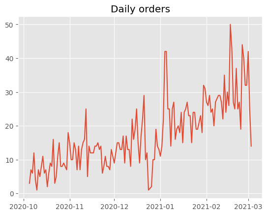
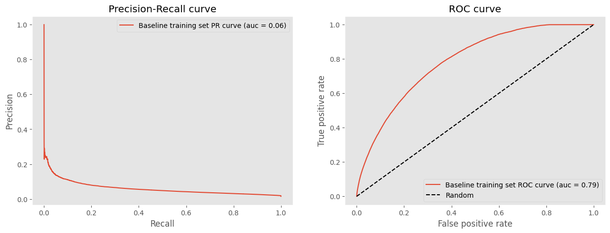
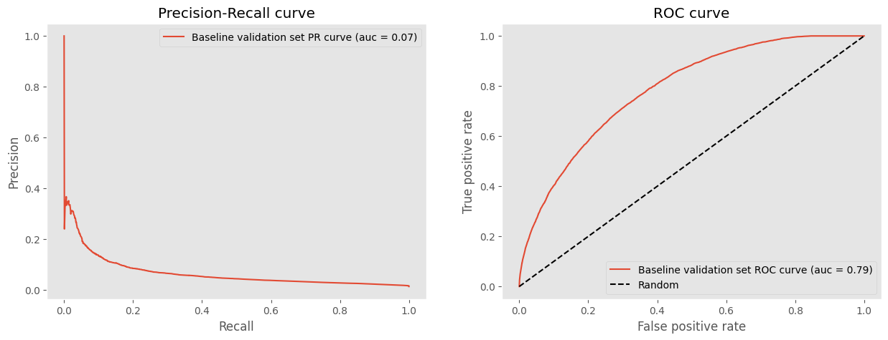
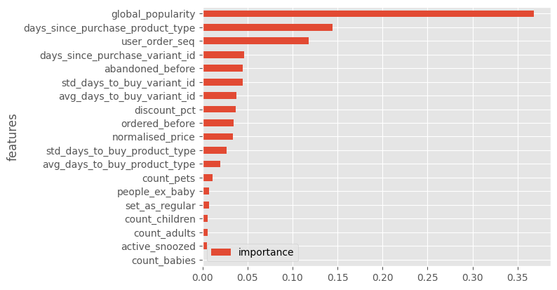
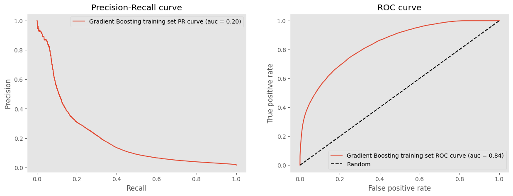
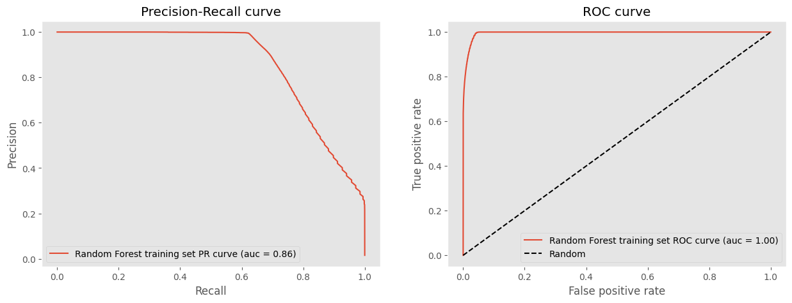
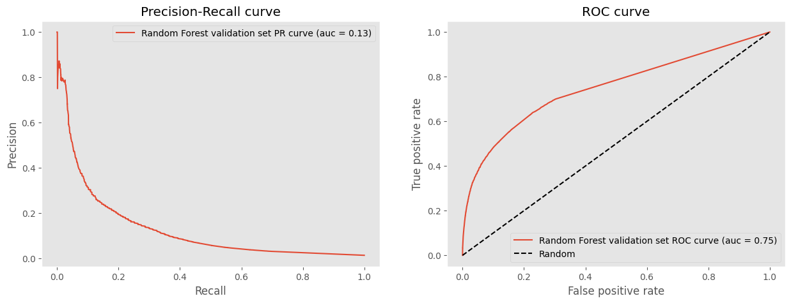
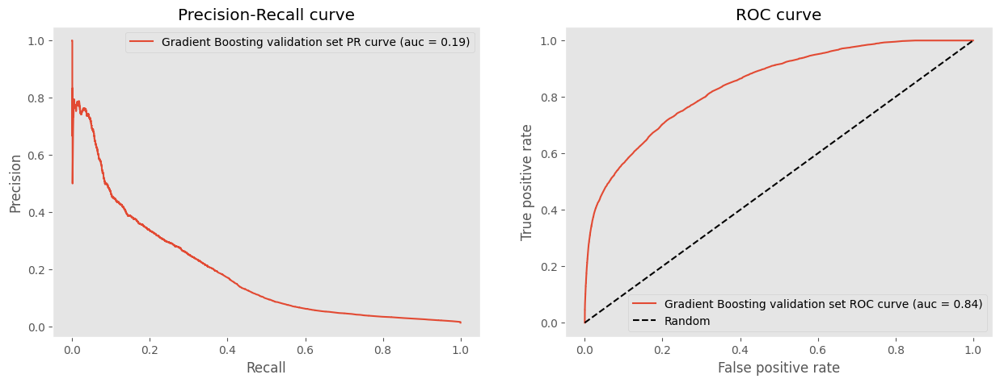
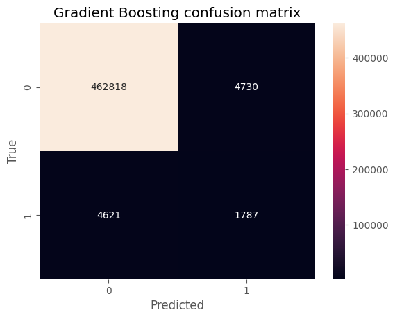
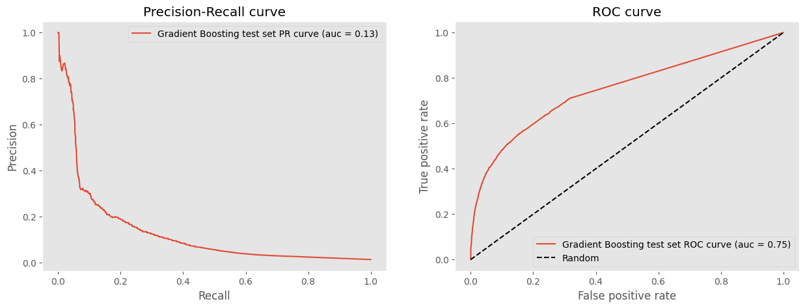

```python
import matplotlib.pyplot as plt
import numpy as np
import pandas as pd
import seaborn as sns
from sklearn.ensemble import GradientBoostingClassifier, RandomForestClassifier
from sklearn.linear_model import LogisticRegression
from sklearn.metrics import (
    auc,
    average_precision_score,
    confusion_matrix,
    precision_recall_curve,
    roc_curve,
)
from sklearn.pipeline import make_pipeline
from sklearn.preprocessing import StandardScaler
```


```python
DATA_DIR = "../../data/module2/"
plt.style.use("ggplot")

df = pd.read_csv(DATA_DIR + "feature_frame.csv")
```


```python
info_cols = ["variant_id", "order_id", "user_id", "created_at", "order_date"]
label_col = "outcome"
features_cols = [col for col in df.columns if col not in info_cols + [label_col]]

categorical_cols = ["product_type", "vendor"]
binary_cols = ["ordered_before", "abandoned_before", "active_snoozed", "set_as_regular"]
numerical_cols = [
    col for col in features_cols if col not in categorical_cols + binary_cols
]
```


```python
def get_relevant_dataframe(df: pd.DataFrame, min_products: int = 5) -> pd.DataFrame:
    """We are only interested in big enough orders that are profitable"""
    order_sizes = df.groupby("order_id").outcome.sum()
    big_enough_orders = order_sizes[order_sizes >= min_products].index
    return df[df.order_id.isin(big_enough_orders)].copy()
```


```python
df_relevant = (
    df.pipe(get_relevant_dataframe)
    .assign(created_at=lambda x: pd.to_datetime(x.created_at))
    .assign(order_date=lambda x: pd.to_datetime(x.order_date).dt.date)
)
```


```python
daily_orders = df_relevant.groupby("order_date").order_id.nunique()
plt.plot(daily_orders, label="Daily orders")
plt.title("Daily orders")
```


    Text(0.5, 1.0, 'Daily orders')


    

    


```python
df_relevant["outcome"].value_counts(normalize=True)
```


    outcome
    0.0    0.985522
    1.0    0.014478
    Name: proportion, dtype: float64


We notice that the target variable is extremely unbalanced. This should be kept in mind when choosing the evaluation metric.

# Project

## Splits


```python
cumsum_daily_orders = daily_orders.cumsum() / daily_orders.sum()

train_val_cutoff = cumsum_daily_orders[cumsum_daily_orders <= 0.7].idxmax()
val_test_cutoff = cumsum_daily_orders[cumsum_daily_orders <= 0.9].idxmax()

print("Train since:", cumsum_daily_orders.index.min())
print("Train until:", train_val_cutoff)
print("Val until:", val_test_cutoff)
print("Test until:", cumsum_daily_orders.index.max())
```

    Train since: 2020-10-05
    Train until: 2021-02-04
    Val until: 2021-02-22
    Test until: 2021-03-03


We have to keep in mind that our models won't capture stationary behavior, which could be considered for further temporal series models. 

Moreover, the split we have performed could be biased if one of the splits has a different distribution than the other, this could happen if the last split match with a special day, e.g., Christmas.


```python
train = df_relevant[df_relevant.order_date <= train_val_cutoff]
val = df_relevant[
    (df_relevant.order_date > train_val_cutoff)
    & (df_relevant.order_date <= val_test_cutoff)
]
test = df_relevant[df_relevant.order_date > val_test_cutoff]
```

## Baseline model


```python
def plot_metrics(model_name: str, y_pred: pd.Series, y_test: pd.Series) -> None:

    fig, ax = plt.subplots(1, 2, figsize=(15, 5))
    precision, recall, _ = precision_recall_curve(y_test, y_pred)
    average_precision = average_precision_score(y_test, y_pred)
    fpr, tpr, _ = roc_curve(y_test, y_pred)
    roc_auc = auc(fpr, tpr)

    ax[0].plot(
        recall,
        precision,
        label=f"{model_name} PR curve (auc = {average_precision:0.2f})",
    )
    ax[0].set_xlabel("Recall")
    ax[0].set_ylabel("Precision")
    ax[0].set_title("Precision-Recall curve")
    ax[0].legend()
    ax[0].grid()

    ax[1].plot(fpr, tpr, label=f"{model_name} ROC curve (auc = {roc_auc:0.2f})")
    ax[1].plot([0, 1], [0, 1], "k--", label="Random")
    ax[1].set_xlabel("False positive rate")
    ax[1].set_ylabel("True positive rate")
    ax[1].set_title("ROC curve")
    ax[1].legend()
    ax[1].grid()
    plt.show()


def feature_label_split(
    df: pd.DataFrame, label_col: str
) -> tuple[pd.DataFrame, pd.Series]:
    X = df.drop(label_col, axis=1)
    y = df[label_col]
    return X, y


def model_metrics(
    model_name: str, y_true: pd.Series, y_pred: pd.Series
) -> tuple[float, float, float]:
    precision, recall, _ = precision_recall_curve(y_true, y_pred)
    average_precision = average_precision_score(y_true, y_pred)
    max_f1 = np.max(2 * precision * recall / (precision + recall))
    fpr, tpr, _ = roc_curve(y_true, y_pred)
    roc_auc = auc(fpr, tpr)
    print(
        f"{model_name}:\t PR curve auc = {average_precision:0.5f}.\t Best F1 score: {max_f1:0.5f}.\t ROC curve auc = {roc_auc:0.5f}."
    )
    return average_precision, max_f1, roc_auc


def plot_feature_importance(clf, columns):
    fig, ax = plt.subplots()
    fi = pd.DataFrame(
        list(zip(columns, clf.feature_importances_)), columns=["features", "importance"]
    ).sort_values(by="importance", ascending=True)
    fi.plot(kind="barh", x="features", y="importance", ax=ax)
    return fi, fig, ax
```


```python
X_train, y_train = feature_label_split(train, label_col)
X_val, y_val = feature_label_split(val, label_col)
X_test, y_test = feature_label_split(test, label_col)
```

We are going to use a simple linear model (logistic regression) as a baseline, based on the `global_popularity` feature.


```python
feature = "global_popularity"

baseline_model = make_pipeline(
    StandardScaler(), LogisticRegression(penalty="l2", C=1.0)
)

baseline_model.fit(X_train[[feature]], y_train)
```


<style>#sk-container-id-2 {
  /* Definition of color scheme common for light and dark mode */
  --sklearn-color-text: black;
  --sklearn-color-line: gray;
  /* Definition of color scheme for unfitted estimators */
  --sklearn-color-unfitted-level-0: #fff5e6;
  --sklearn-color-unfitted-level-1: #f6e4d2;
  --sklearn-color-unfitted-level-2: #ffe0b3;
  --sklearn-color-unfitted-level-3: chocolate;
  /* Definition of color scheme for fitted estimators */
  --sklearn-color-fitted-level-0: #f0f8ff;
  --sklearn-color-fitted-level-1: #d4ebff;
  --sklearn-color-fitted-level-2: #b3dbfd;
  --sklearn-color-fitted-level-3: cornflowerblue;

  /* Specific color for light theme */
  --sklearn-color-text-on-default-background: var(--sg-text-color, var(--theme-code-foreground, var(--jp-content-font-color1, black)));
  --sklearn-color-background: var(--sg-background-color, var(--theme-background, var(--jp-layout-color0, white)));
  --sklearn-color-border-box: var(--sg-text-color, var(--theme-code-foreground, var(--jp-content-font-color1, black)));
  --sklearn-color-icon: #696969;

  @media (prefers-color-scheme: dark) {
    /* Redefinition of color scheme for dark theme */
    --sklearn-color-text-on-default-background: var(--sg-text-color, var(--theme-code-foreground, var(--jp-content-font-color1, white)));
    --sklearn-color-background: var(--sg-background-color, var(--theme-background, var(--jp-layout-color0, #111)));
    --sklearn-color-border-box: var(--sg-text-color, var(--theme-code-foreground, var(--jp-content-font-color1, white)));
    --sklearn-color-icon: #878787;
  }
}

#sk-container-id-2 {
  color: var(--sklearn-color-text);
}

#sk-container-id-2 pre {
  padding: 0;
}

#sk-container-id-2 input.sk-hidden--visually {
  border: 0;
  clip: rect(1px 1px 1px 1px);
  clip: rect(1px, 1px, 1px, 1px);
  height: 1px;
  margin: -1px;
  overflow: hidden;
  padding: 0;
  position: absolute;
  width: 1px;
}

#sk-container-id-2 div.sk-dashed-wrapped {
  border: 1px dashed var(--sklearn-color-line);
  margin: 0 0.4em 0.5em 0.4em;
  box-sizing: border-box;
  padding-bottom: 0.4em;
  background-color: var(--sklearn-color-background);
}

#sk-container-id-2 div.sk-container {
  /* jupyter's `normalize.less` sets `[hidden] { display: none; }`
     but bootstrap.min.css set `[hidden] { display: none !important; }`
     so we also need the `!important` here to be able to override the
     default hidden behavior on the sphinx rendered scikit-learn.org.
     See: https://github.com/scikit-learn/scikit-learn/issues/21755 */
  display: inline-block !important;
  position: relative;
}

#sk-container-id-2 div.sk-text-repr-fallback {
  display: none;
}

div.sk-parallel-item,
div.sk-serial,
div.sk-item {
  /* draw centered vertical line to link estimators */
  background-image: linear-gradient(var(--sklearn-color-text-on-default-background), var(--sklearn-color-text-on-default-background));
  background-size: 2px 100%;
  background-repeat: no-repeat;
  background-position: center center;
}

/* Parallel-specific style estimator block */

#sk-container-id-2 div.sk-parallel-item::after {
  content: "";
  width: 100%;
  border-bottom: 2px solid var(--sklearn-color-text-on-default-background);
  flex-grow: 1;
}

#sk-container-id-2 div.sk-parallel {
  display: flex;
  align-items: stretch;
  justify-content: center;
  background-color: var(--sklearn-color-background);
  position: relative;
}

#sk-container-id-2 div.sk-parallel-item {
  display: flex;
  flex-direction: column;
}

#sk-container-id-2 div.sk-parallel-item:first-child::after {
  align-self: flex-end;
  width: 50%;
}

#sk-container-id-2 div.sk-parallel-item:last-child::after {
  align-self: flex-start;
  width: 50%;
}

#sk-container-id-2 div.sk-parallel-item:only-child::after {
  width: 0;
}

/* Serial-specific style estimator block */

#sk-container-id-2 div.sk-serial {
  display: flex;
  flex-direction: column;
  align-items: center;
  background-color: var(--sklearn-color-background);
  padding-right: 1em;
  padding-left: 1em;
}


/* Toggleable style: style used for estimator/Pipeline/ColumnTransformer box that is
clickable and can be expanded/collapsed.
- Pipeline and ColumnTransformer use this feature and define the default style
- Estimators will overwrite some part of the style using the `sk-estimator` class
*/

/* Pipeline and ColumnTransformer style (default) */

#sk-container-id-2 div.sk-toggleable {
  /* Default theme specific background. It is overwritten whether we have a
  specific estimator or a Pipeline/ColumnTransformer */
  background-color: var(--sklearn-color-background);
}

/* Toggleable label */
#sk-container-id-2 label.sk-toggleable__label {
  cursor: pointer;
  display: block;
  width: 100%;
  margin-bottom: 0;
  padding: 0.5em;
  box-sizing: border-box;
  text-align: center;
}

#sk-container-id-2 label.sk-toggleable__label-arrow:before {
  /* Arrow on the left of the label */
  content: "▸";
  float: left;
  margin-right: 0.25em;
  color: var(--sklearn-color-icon);
}

#sk-container-id-2 label.sk-toggleable__label-arrow:hover:before {
  color: var(--sklearn-color-text);
}

/* Toggleable content - dropdown */

#sk-container-id-2 div.sk-toggleable__content {
  max-height: 0;
  max-width: 0;
  overflow: hidden;
  text-align: left;
  /* unfitted */
  background-color: var(--sklearn-color-unfitted-level-0);
}

#sk-container-id-2 div.sk-toggleable__content.fitted {
  /* fitted */
  background-color: var(--sklearn-color-fitted-level-0);
}

#sk-container-id-2 div.sk-toggleable__content pre {
  margin: 0.2em;
  border-radius: 0.25em;
  color: var(--sklearn-color-text);
  /* unfitted */
  background-color: var(--sklearn-color-unfitted-level-0);
}

#sk-container-id-2 div.sk-toggleable__content.fitted pre {
  /* unfitted */
  background-color: var(--sklearn-color-fitted-level-0);
}

#sk-container-id-2 input.sk-toggleable__control:checked~div.sk-toggleable__content {
  /* Expand drop-down */
  max-height: 200px;
  max-width: 100%;
  overflow: auto;
}

#sk-container-id-2 input.sk-toggleable__control:checked~label.sk-toggleable__label-arrow:before {
  content: "▾";
}

/* Pipeline/ColumnTransformer-specific style */

#sk-container-id-2 div.sk-label input.sk-toggleable__control:checked~label.sk-toggleable__label {
  color: var(--sklearn-color-text);
  background-color: var(--sklearn-color-unfitted-level-2);
}

#sk-container-id-2 div.sk-label.fitted input.sk-toggleable__control:checked~label.sk-toggleable__label {
  background-color: var(--sklearn-color-fitted-level-2);
}

/* Estimator-specific style */

/* Colorize estimator box */
#sk-container-id-2 div.sk-estimator input.sk-toggleable__control:checked~label.sk-toggleable__label {
  /* unfitted */
  background-color: var(--sklearn-color-unfitted-level-2);
}

#sk-container-id-2 div.sk-estimator.fitted input.sk-toggleable__control:checked~label.sk-toggleable__label {
  /* fitted */
  background-color: var(--sklearn-color-fitted-level-2);
}

#sk-container-id-2 div.sk-label label.sk-toggleable__label,
#sk-container-id-2 div.sk-label label {
  /* The background is the default theme color */
  color: var(--sklearn-color-text-on-default-background);
}

/* On hover, darken the color of the background */
#sk-container-id-2 div.sk-label:hover label.sk-toggleable__label {
  color: var(--sklearn-color-text);
  background-color: var(--sklearn-color-unfitted-level-2);
}

/* Label box, darken color on hover, fitted */
#sk-container-id-2 div.sk-label.fitted:hover label.sk-toggleable__label.fitted {
  color: var(--sklearn-color-text);
  background-color: var(--sklearn-color-fitted-level-2);
}

/* Estimator label */

#sk-container-id-2 div.sk-label label {
  font-family: monospace;
  font-weight: bold;
  display: inline-block;
  line-height: 1.2em;
}

#sk-container-id-2 div.sk-label-container {
  text-align: center;
}

/* Estimator-specific */
#sk-container-id-2 div.sk-estimator {
  font-family: monospace;
  border: 1px dotted var(--sklearn-color-border-box);
  border-radius: 0.25em;
  box-sizing: border-box;
  margin-bottom: 0.5em;
  /* unfitted */
  background-color: var(--sklearn-color-unfitted-level-0);
}

#sk-container-id-2 div.sk-estimator.fitted {
  /* fitted */
  background-color: var(--sklearn-color-fitted-level-0);
}

/* on hover */
#sk-container-id-2 div.sk-estimator:hover {
  /* unfitted */
  background-color: var(--sklearn-color-unfitted-level-2);
}

#sk-container-id-2 div.sk-estimator.fitted:hover {
  /* fitted */
  background-color: var(--sklearn-color-fitted-level-2);
}

/* Specification for estimator info (e.g. "i" and "?") */

/* Common style for "i" and "?" */

.sk-estimator-doc-link,
a:link.sk-estimator-doc-link,
a:visited.sk-estimator-doc-link {
  float: right;
  font-size: smaller;
  line-height: 1em;
  font-family: monospace;
  background-color: var(--sklearn-color-background);
  border-radius: 1em;
  height: 1em;
  width: 1em;
  text-decoration: none !important;
  margin-left: 1ex;
  /* unfitted */
  border: var(--sklearn-color-unfitted-level-1) 1pt solid;
  color: var(--sklearn-color-unfitted-level-1);
}

.sk-estimator-doc-link.fitted,
a:link.sk-estimator-doc-link.fitted,
a:visited.sk-estimator-doc-link.fitted {
  /* fitted */
  border: var(--sklearn-color-fitted-level-1) 1pt solid;
  color: var(--sklearn-color-fitted-level-1);
}

/* On hover */
div.sk-estimator:hover .sk-estimator-doc-link:hover,
.sk-estimator-doc-link:hover,
div.sk-label-container:hover .sk-estimator-doc-link:hover,
.sk-estimator-doc-link:hover {
  /* unfitted */
  background-color: var(--sklearn-color-unfitted-level-3);
  color: var(--sklearn-color-background);
  text-decoration: none;
}

div.sk-estimator.fitted:hover .sk-estimator-doc-link.fitted:hover,
.sk-estimator-doc-link.fitted:hover,
div.sk-label-container:hover .sk-estimator-doc-link.fitted:hover,
.sk-estimator-doc-link.fitted:hover {
  /* fitted */
  background-color: var(--sklearn-color-fitted-level-3);
  color: var(--sklearn-color-background);
  text-decoration: none;
}

/* Span, style for the box shown on hovering the info icon */
.sk-estimator-doc-link span {
  display: none;
  z-index: 9999;
  position: relative;
  font-weight: normal;
  right: .2ex;
  padding: .5ex;
  margin: .5ex;
  width: min-content;
  min-width: 20ex;
  max-width: 50ex;
  color: var(--sklearn-color-text);
  box-shadow: 2pt 2pt 4pt #999;
  /* unfitted */
  background: var(--sklearn-color-unfitted-level-0);
  border: .5pt solid var(--sklearn-color-unfitted-level-3);
}

.sk-estimator-doc-link.fitted span {
  /* fitted */
  background: var(--sklearn-color-fitted-level-0);
  border: var(--sklearn-color-fitted-level-3);
}

.sk-estimator-doc-link:hover span {
  display: block;
}

/* "?"-specific style due to the `<a>` HTML tag */

#sk-container-id-2 a.estimator_doc_link {
  float: right;
  font-size: 1rem;
  line-height: 1em;
  font-family: monospace;
  background-color: var(--sklearn-color-background);
  border-radius: 1rem;
  height: 1rem;
  width: 1rem;
  text-decoration: none;
  /* unfitted */
  color: var(--sklearn-color-unfitted-level-1);
  border: var(--sklearn-color-unfitted-level-1) 1pt solid;
}

#sk-container-id-2 a.estimator_doc_link.fitted {
  /* fitted */
  border: var(--sklearn-color-fitted-level-1) 1pt solid;
  color: var(--sklearn-color-fitted-level-1);
}

/* On hover */
#sk-container-id-2 a.estimator_doc_link:hover {
  /* unfitted */
  background-color: var(--sklearn-color-unfitted-level-3);
  color: var(--sklearn-color-background);
  text-decoration: none;
}

#sk-container-id-2 a.estimator_doc_link.fitted:hover {
  /* fitted */
  background-color: var(--sklearn-color-fitted-level-3);
}
</style><div id="sk-container-id-2" class="sk-top-container"><div class="sk-text-repr-fallback"><pre>Pipeline(steps=[(&#x27;standardscaler&#x27;, StandardScaler()),
                (&#x27;logisticregression&#x27;, LogisticRegression())])</pre><b>In a Jupyter environment, please rerun this cell to show the HTML representation or trust the notebook. <br />On GitHub, the HTML representation is unable to render, please try loading this page with nbviewer.org.</b></div><div class="sk-container" hidden><div class="sk-item sk-dashed-wrapped"><div class="sk-label-container"><div class="sk-label fitted sk-toggleable"><input class="sk-toggleable__control sk-hidden--visually" id="sk-estimator-id-4" type="checkbox" ><label for="sk-estimator-id-4" class="sk-toggleable__label fitted sk-toggleable__label-arrow fitted">&nbsp;&nbsp;Pipeline<a class="sk-estimator-doc-link fitted" rel="noreferrer" target="_blank" href="https://scikit-learn.org/1.5/modules/generated/sklearn.pipeline.Pipeline.html">?<span>Documentation for Pipeline</span></a><span class="sk-estimator-doc-link fitted">i<span>Fitted</span></span></label><div class="sk-toggleable__content fitted"><pre>Pipeline(steps=[(&#x27;standardscaler&#x27;, StandardScaler()),
                (&#x27;logisticregression&#x27;, LogisticRegression())])</pre></div> </div></div><div class="sk-serial"><div class="sk-item"><div class="sk-estimator fitted sk-toggleable"><input class="sk-toggleable__control sk-hidden--visually" id="sk-estimator-id-5" type="checkbox" ><label for="sk-estimator-id-5" class="sk-toggleable__label fitted sk-toggleable__label-arrow fitted">&nbsp;StandardScaler<a class="sk-estimator-doc-link fitted" rel="noreferrer" target="_blank" href="https://scikit-learn.org/1.5/modules/generated/sklearn.preprocessing.StandardScaler.html">?<span>Documentation for StandardScaler</span></a></label><div class="sk-toggleable__content fitted"><pre>StandardScaler()</pre></div> </div></div><div class="sk-item"><div class="sk-estimator fitted sk-toggleable"><input class="sk-toggleable__control sk-hidden--visually" id="sk-estimator-id-6" type="checkbox" ><label for="sk-estimator-id-6" class="sk-toggleable__label fitted sk-toggleable__label-arrow fitted">&nbsp;LogisticRegression<a class="sk-estimator-doc-link fitted" rel="noreferrer" target="_blank" href="https://scikit-learn.org/1.5/modules/generated/sklearn.linear_model.LogisticRegression.html">?<span>Documentation for LogisticRegression</span></a></label><div class="sk-toggleable__content fitted"><pre>LogisticRegression()</pre></div> </div></div></div></div></div></div>


```python
train_prob = baseline_model.predict_proba(X_train[[feature]])[:, 1]
plot_metrics("Baseline training set", train_prob, y_train)

val_prob = baseline_model.predict_proba(X_val[[feature]])[:, 1]
plot_metrics("Baseline validation set", val_prob, y_val)
```


    

    


    

    


## Non-linear Models


```python
train_cols = numerical_cols + binary_cols  # leave out categorical columns
```


```python
history = {}

n_trees = [5, 25, 50, 100]
for n in n_trees:
    rf = RandomForestClassifier(n_estimators=n)
    rf.fit(X_train[train_cols], y_train)
    val_prob = rf.predict_proba(X_val[train_cols])[:, 1]

    history[n] = model_metrics(f"Random Forest n={n} validation set", y_val, val_prob)

print(history)
```

    Random Forest n=5 validation set:	 PR curve auc = 0.07204.	 Best F1 score: 0.17073.	 ROC curve auc = 0.64250.
    Random Forest n=25 validation set:	 PR curve auc = 0.11133.	 Best F1 score: 0.19530.	 ROC curve auc = 0.71851.
    Random Forest n=50 validation set:	 PR curve auc = 0.12251.	 Best F1 score: 0.19497.	 ROC curve auc = 0.73376.
    Random Forest n=100 validation set:	 PR curve auc = 0.12573.	 Best F1 score: 0.19916.	 ROC curve auc = 0.75015.
    {5: (0.07203687420522621, 0.17073362102785408, 0.6424986811891702), 25: (0.11132640273698625, 0.195297408912276, 0.7185063855447764), 50: (0.12250798753103241, 0.19496664645239536, 0.7337634663215015), 100: (0.12572895600587977, 0.19916083916083915, 0.7501471662207085)}


The best RF model was the one with 100 trees


```python
rf = RandomForestClassifier(n_estimators=100)
rf.fit(X_train[train_cols], y_train)
```


```python
plot_feature_importance(rf, train_cols)
```


    (                            features  importance
     6                       count_babies    0.001028
     17                    active_snoozed    0.004735
     4                       count_adults    0.005637
     5                     count_children    0.005865
     18                    set_as_regular    0.007120
     8                     people_ex_baby    0.007630
     7                         count_pets    0.011562
     13      avg_days_to_buy_product_type    0.019504
     14      std_days_to_buy_product_type    0.026635
     1                   normalised_price    0.033636
     15                    ordered_before    0.034747
     2                       discount_pct    0.037252
     10        avg_days_to_buy_variant_id    0.037964
     11        std_days_to_buy_variant_id    0.044750
     16                  abandoned_before    0.044998
     9     days_since_purchase_variant_id    0.046368
     0                     user_order_seq    0.118143
     12  days_since_purchase_product_type    0.144422
     3                  global_popularity    0.368003,
     <Figure size 640x480 with 1 Axes>,
     <Axes: ylabel='features'>)


    

    


```python
n_estimators = [20, 50, 100]
learning_rate = [0.1, 0.05]

history = {}

for n in n_estimators:
    for lr in learning_rate:
        gb = GradientBoostingClassifier(n_estimators=n, learning_rate=lr)
        gb.fit(X_train[train_cols], y_train)
        val_prob = gb.predict_proba(X_val[train_cols])[:, 1]
        history[(n, lr)] = model_metrics(
            f"Gradient Boosting n={n} lr={lr} validation set", y_val, val_prob
        )
```

    Gradient Boosting n=20 lr=0.1 validation set:	 PR curve auc = 0.18212.	 Best F1 score: 0.26614.	 ROC curve auc = 0.84133.
    Gradient Boosting n=20 lr=0.05 validation set:	 PR curve auc = 0.16421.	 Best F1 score: 0.25265.	 ROC curve auc = 0.82257.
    Gradient Boosting n=50 lr=0.1 validation set:	 PR curve auc = 0.18737.	 Best F1 score: 0.27207.	 ROC curve auc = 0.84388.
    Gradient Boosting n=50 lr=0.05 validation set:	 PR curve auc = 0.18644.	 Best F1 score: 0.27224.	 ROC curve auc = 0.84078.
    Gradient Boosting n=100 lr=0.1 validation set:	 PR curve auc = 0.18766.	 Best F1 score: 0.27428.	 ROC curve auc = 0.84626.
    Gradient Boosting n=100 lr=0.05 validation set:	 PR curve auc = 0.19093.	 Best F1 score: 0.27657.	 ROC curve auc = 0.84395.


The GBT model that performed best was the one with 100 trees, a learning rate of 0.05.


```python
gb = GradientBoostingClassifier(n_estimators=100, learning_rate=0.05)
gb.fit(X_train[train_cols], y_train)
```


```python
plot_metrics(
    "Baseline training set",
    baseline_model.predict_proba(X_train[[feature]])[:, 1],
    y_train,
)

plot_metrics(
    "Gradient Boosting training set",
    gb.predict_proba(X_train[train_cols])[:, 1],
    y_train,
)

plot_metrics(
    "Random Forest training set", rf.predict_proba(X_train[train_cols])[:, 1], y_train
)
```


    

    


    

    


    

    


```python
plot_metrics(
    "Baseline validation set",
    baseline_model.predict_proba(X_val[[feature]])[:, 1],
    y_val,
)

plot_metrics(
    "Random Forest validation set", rf.predict_proba(X_val[train_cols])[:, 1], y_val
)

plot_metrics(
    "Gradient Boosting validation set", gb.predict_proba(X_val[train_cols])[:, 1], y_val
)
```


    

    


    

    


    

    


```python
def get_best_threshold(y_true: pd.Series, y_pred: pd.Series) -> float:
    precision, recall, thresholds = precision_recall_curve(y_true, y_pred)
    f1 = 2 * precision * recall / (precision + recall)
    return thresholds[np.argmax(f1)]
```


```python
random_forest_val_pred = rf.predict_proba(X_val[train_cols])[:, 1]
random_forest_threshold = get_best_threshold(y_val, random_forest_val_pred)

gradient_boosting_val_pred = gb.predict_proba(X_val[train_cols])[:, 1]
gradient_boosting_threshold = get_best_threshold(y_val, gradient_boosting_val_pred)
```


```python
def plot_confusion_matrix(
    model_name: str, y_true: pd.Series, y_pred: pd.Series, threshold: float
) -> None:

    fig, ax = plt.subplots()
    y_pred_binary = y_pred > threshold
    cm = confusion_matrix(y_true, y_pred_binary)
    sns.heatmap(cm, annot=True, fmt="d", ax=ax)
    ax.set_xlabel("Predicted")
    ax.set_ylabel("True")
    ax.set_title(f"{model_name} confusion matrix")
    plt.show()
```


```python
plot_confusion_matrix(
    "Random Forest", y_val, random_forest_val_pred, random_forest_threshold
)

plot_confusion_matrix(
    "Gradient Boosting", y_val, gradient_boosting_val_pred, gradient_boosting_threshold
)
```


    

    


    

    


```python
accuracy_random_forest = (
    rf.predict_proba(X_val[train_cols])[:, 1] > random_forest_threshold
).mean()
accuracy_gradient_boosting = (
    gb.predict_proba(X_val[train_cols])[:, 1] > gradient_boosting_threshold
).mean()

print(f"Random Forest accuracy: {accuracy_random_forest:0.5f}")
print(f"Gradient Boosting accuracy: {accuracy_gradient_boosting:0.5f}")
```

    Random Forest accuracy: 0.01665
    Gradient Boosting accuracy: 0.01375


The RF model performed better than the GBT model.

# Test


```python
rf_test_pred = rf.predict_proba(X_test[train_cols])[:, 1]

plot_metrics("Gradient Boosting test set", rf_test_pred, y_test)
```


    

    


```python
best_test_threshold = get_best_threshold(y_test, rf_test_pred)
print(best_test_threshold)
plot_confusion_matrix("Random Forest", y_test, rf_test_pred, best_test_threshold)
```

    0.23


    

    


```python
accuracy_rf_test = (
    rf.predict_proba(X_test[train_cols])[:, 1] > best_test_threshold
).mean()
accuracy_rf_test
```


    0.01599001051325163


We are going to use a RF model
